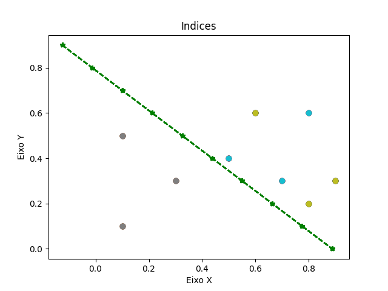

# Trabalho 2 de Inteligência Artificial – manha
---
## Código Algoritmo Perceptron

```python
from __future__ import division
from collections import Counter
from functools import partial

import matplotlib
import matplotlib.pyplot as plt
import numpy
from linear_algebra import dot


def degrau(x):
    return 1 if x >= 0 else 0


def saida_perceptron(pesos, entradas):
    y = dot(pesos, entradas)
    return degrau(y)


def ajustes(sinapses, entradas, saida):
    taxa_aprendizagem = 0.0981
    saida_parcial = saida_perceptron(sinapses, entradas)

    for j in range(3):
        sinapses[j] = sinapses[j] + taxa_aprendizagem * \
            (saida[0] - saida_parcial) * entradas[j]
    saida = saida_parcial
    return sinapses, saida


def teste_generalizacao(sinapses, entradas, saida):
    saida_parcial = saida_perceptron(sinapses, entradas)
    saida = saida_parcial
    return sinapses, saida


neuronio = [0.22, -0.33, 0.44]
padrao_0_0 = [-1, 0.2, 0.5]
padrao_0_1 = [-1, 0.1, 0.7]
padrao_0_2 = [-1, 0.3, 0.4]
padrao_1_0 = [-1, 0.9, 0.7]
padrao_1_1 = [-1, 0.7, 0.6]
padrao_1_2 = [-1, 0.9, 0.7]
saida0 = [0]
saida1 = [1]

for x in range(20):
    neuronio, saida_0 = ajustes(neuronio, padrao_0_0, saida0)
    print(neuronio, "Saida 0 = ", saida_0)
    neuronio, saida_0 = ajustes(neuronio, padrao_0_1, saida0)
    print(neuronio, "Saida 0 = ", saida_0)
    neuronio, saida_0 = ajustes(neuronio, padrao_0_2, saida0)
    print(neuronio, "Saida 0 = ", saida_0)
    neuronio, saida_1 = ajustes(neuronio, padrao_1_0, saida1)
    print(neuronio, "Saida 1 = ", saida_1)
    neuronio, saida_1 = ajustes(neuronio, padrao_1_1, saida1)
    print(neuronio, "Saida 1 = ", saida_1)
    neuronio, saida_1 = ajustes(neuronio, padrao_1_2, saida1)
    print(neuronio, "Saida 1 = ", saida_1)

    x = [0.9, 0.8, 0.7, 0.6, 0.5, 0.4, 0.3, 0.2, 0.1, 0.0]
    y = [-0.125, -0.0125, 0.1, 0.2125, 0.325,
         0.4375, 0.55, 0.6625, 0.775, 0.8875]
    x1 = [0.1, 0.5, 0.3]
    x2 = [0.6, 0.2, 0.3]
    x3 = [0.3, 0.4, 0.6]
    y1 = [0.1, 0.1, 0.3]
    y2 = [0.6, 0.8, 0.9]
    y3 = [0.7, 0.5, 0.8]

    # pontos x e y no gráfico
    plt.scatter(y1, x1)
    plt.scatter(y2, x2)
    plt.scatter(y3, x3)

    # linha que divide
    plt.plot(y, x, color='green', marker='*', linestyle='--')

    # a valid value for ls; supported values are '-', '--', '-.', ':', 'None', '', '', 'solid', 'dashed', 'dashdot', 'dotted'

    plt.title("Indices")
    plt.xlabel("Eixo X")
    plt.ylabel("Eixo Y")
    # plt.show()

    padrao_teste_0 = [-1, 0.2, 0.4]
    padrao_teste_1 = [-1, 0.7, 0.8]
    padrao_teste_2 = [-1, 0.6, 0.3]
    padrao_teste_3 = [-1, 0.1, 0.9]
    padrao_teste_4 = [-1, 0.2, 0.6]
    padrao_teste_5 = [-1, 0.8, 0.1]

    print("TESTE DE GENERALIZACAO")
    neuronio, saida_0 = teste_generalizacao(neuronio, padrao_teste_0, saida0)
    print(neuronio, "entre ano x e y = ", saida_0)
    neuronio, saida_1 = teste_generalizacao(neuronio, padrao_teste_1, saida1)
    print(neuronio, "entre ano w e z = ", saida_1)
    neuronio, saida_0 = teste_generalizacao(neuronio, padrao_teste_2, saida0)
    print(neuronio, "entre ano x e y = ", saida_0)
    neuronio, saida_1 = teste_generalizacao(neuronio, padrao_teste_3, saida1)
    print(neuronio, "entre ano w e z = ", saida_1)
    neuronio, saida_0 = teste_generalizacao(neuronio, padrao_teste_4, saida0)
    print(neuronio, "entre ano x e y = ", saida_0)
    neuronio, saida_1 = teste_generalizacao(neuronio, padrao_teste_5, saida1)
    print(neuronio, "entre ano w e z = ", saida_1)

plt.show()

```
---
## Console

```powershell
PS D:\workspace\IA> & C:/Users/bapti/AppData/Local/Programs/Python/Python310/python.exe d:/workspace/IA/tp2/tp2.py
[0.22, -0.33, 0.44] Saida 0 =  0
[0.3181, -0.33981, 0.37133] Saida 0 =  1
[0.3181, -0.33981, 0.37133] Saida 0 =  0
[0.21999999999999997, -0.25151999999999997, 0.44] Saida 1 =  0   
[0.12189999999999997, -0.18284999999999996, 0.49886] Saida 1 =  0
[0.12189999999999997, -0.18284999999999996, 0.49886] Saida 1 =  1
TESTE DE GENERALIZACAO
[0.12189999999999997, -0.18284999999999996, 0.49886] entre ano x e y =  1
[0.12189999999999997, -0.18284999999999996, 0.49886] entre ano w e z =  1
[0.12189999999999997, -0.18284999999999996, 0.49886] entre ano x e y =  0
[0.12189999999999997, -0.18284999999999996, 0.49886] entre ano w e z =  1
[0.12189999999999997, -0.18284999999999996, 0.49886] entre ano x e y =  1
[0.12189999999999997, -0.18284999999999996, 0.49886] entre ano w e z =  0
[0.21999999999999997, -0.20246999999999996, 0.44981000000000004] Saida 0 =  1
[0.3181, -0.21227999999999997, 0.38114000000000003] Saida 0 =  1
[0.3181, -0.21227999999999997, 0.38114000000000003] Saida 0 =  0
[0.21999999999999997, -0.12398999999999996, 0.44981000000000004] Saida 1 =  0
[0.12189999999999997, -0.055319999999999966, 0.5086700000000001] Saida 1 =  0
[0.12189999999999997, -0.055319999999999966, 0.5086700000000001] Saida 1 =  1
TESTE DE GENERALIZACAO
[0.12189999999999997, -0.055319999999999966, 0.5086700000000001] entre ano x e y =  1
[0.12189999999999997, -0.055319999999999966, 0.5086700000000001] entre ano w e z =  1
[0.12189999999999997, -0.055319999999999966, 0.5086700000000001] entre ano x e y =  0
[0.12189999999999997, -0.055319999999999966, 0.5086700000000001] entre ano w e z =  1
[0.12189999999999997, -0.055319999999999966, 0.5086700000000001] entre ano x e y =  1
[0.12189999999999997, -0.055319999999999966, 0.5086700000000001] entre ano w e z =  0
[0.21999999999999997, -0.07493999999999996, 0.4596200000000001] Saida 0 =  1
[0.3181, -0.08474999999999996, 0.3909500000000001] Saida 0 =  1
[0.3181, -0.08474999999999996, 0.3909500000000001] Saida 0 =  0
[0.21999999999999997, 0.003540000000000043, 0.4596200000000001] Saida 1 =  0
[0.21999999999999997, 0.003540000000000043, 0.4596200000000001] Saida 1 =  1
[0.21999999999999997, 0.003540000000000043, 0.4596200000000001] Saida 1 =  1
TESTE DE GENERALIZACAO
[0.21999999999999997, 0.003540000000000043, 0.4596200000000001] entre ano x e y =  0
[0.21999999999999997, 0.003540000000000043, 0.4596200000000001] entre ano w e z =  1
[0.21999999999999997, 0.003540000000000043, 0.4596200000000001] entre ano x e y =  0
[0.21999999999999997, 0.003540000000000043, 0.4596200000000001] entre ano w e z =  1
[0.21999999999999997, 0.003540000000000043, 0.4596200000000001] entre ano x e y =  1
[0.21999999999999997, 0.003540000000000043, 0.4596200000000001] entre ano w e z =  0
[0.3181, -0.01607999999999996, 0.4105700000000001] Saida 0 =  1
[0.3181, -0.01607999999999996, 0.4105700000000001] Saida 0 =  0
[0.3181, -0.01607999999999996, 0.4105700000000001] Saida 0 =  0
[0.21999999999999997, 0.07221000000000005, 0.4792400000000001] Saida 1 =  0
[0.21999999999999997, 0.07221000000000005, 0.4792400000000001] Saida 1 =  1
[0.21999999999999997, 0.07221000000000005, 0.4792400000000001] Saida 1 =  1
TESTE DE GENERALIZACAO
[0.21999999999999997, 0.07221000000000005, 0.4792400000000001] entre ano x e y =  0
[0.21999999999999997, 0.07221000000000005, 0.4792400000000001] entre ano w e z =  1
[0.21999999999999997, 0.07221000000000005, 0.4792400000000001] entre ano x e y =  0
[0.21999999999999997, 0.07221000000000005, 0.4792400000000001] entre ano w e z =  1
[0.21999999999999997, 0.07221000000000005, 0.4792400000000001] entre ano x e y =  1
[0.21999999999999997, 0.07221000000000005, 0.4792400000000001] entre ano w e z =  0
[0.3181, 0.05259000000000005, 0.43019000000000013] Saida 0 =  1
[0.3181, 0.05259000000000005, 0.43019000000000013] Saida 0 =  0
[0.3181, 0.05259000000000005, 0.43019000000000013] Saida 0 =  0
[0.3181, 0.05259000000000005, 0.43019000000000013] Saida 1 =  1
[0.21999999999999997, 0.12126000000000005, 0.48905000000000015] Saida 1 =  0
[0.21999999999999997, 0.12126000000000005, 0.48905000000000015] Saida 1 =  1
TESTE DE GENERALIZACAO
[0.21999999999999997, 0.12126000000000005, 0.48905000000000015] entre ano x e y =  0
[0.21999999999999997, 0.12126000000000005, 0.48905000000000015] entre ano w e z =  1
[0.21999999999999997, 0.12126000000000005, 0.48905000000000015] entre ano x e y =  0
[0.21999999999999997, 0.12126000000000005, 0.48905000000000015] entre ano w e z =  1
[0.21999999999999997, 0.12126000000000005, 0.48905000000000015] entre ano x e y =  1
[0.21999999999999997, 0.12126000000000005, 0.48905000000000015] entre ano w e z =  0
[0.3181, 0.10164000000000005, 0.44000000000000017] Saida 0 =  1
[0.4162, 0.09183000000000005, 0.37133000000000016] Saida 0 =  1
[0.4162, 0.09183000000000005, 0.37133000000000016] Saida 0 =  0
[0.3181, 0.18012000000000006, 0.44000000000000017] Saida 1 =  0
[0.3181, 0.18012000000000006, 0.44000000000000017] Saida 1 =  1
[0.3181, 0.18012000000000006, 0.44000000000000017] Saida 1 =  1
TESTE DE GENERALIZACAO
[0.3181, 0.18012000000000006, 0.44000000000000017] entre ano x e y =  0
[0.3181, 0.18012000000000006, 0.44000000000000017] entre ano w e z =  1
[0.3181, 0.18012000000000006, 0.44000000000000017] entre ano x e y =  0
[0.3181, 0.18012000000000006, 0.44000000000000017] entre ano w e z =  1
[0.3181, 0.18012000000000006, 0.44000000000000017] entre ano x e y =  0
[0.3181, 0.18012000000000006, 0.44000000000000017] entre ano w e z =  0
[0.3181, 0.18012000000000006, 0.44000000000000017] Saida 0 =  0
[0.4162, 0.17031000000000004, 0.37133000000000016] Saida 0 =  1
[0.4162, 0.17031000000000004, 0.37133000000000016] Saida 0 =  0
[0.3181, 0.25860000000000005, 0.44000000000000017] Saida 1 =  0
[0.3181, 0.25860000000000005, 0.44000000000000017] Saida 1 =  1
[0.3181, 0.25860000000000005, 0.44000000000000017] Saida 1 =  1
TESTE DE GENERALIZACAO
[0.3181, 0.25860000000000005, 0.44000000000000017] entre ano x e y =  0
[0.3181, 0.25860000000000005, 0.44000000000000017] entre ano w e z =  1
[0.3181, 0.25860000000000005, 0.44000000000000017] entre ano x e y =  0
[0.3181, 0.25860000000000005, 0.44000000000000017] entre ano w e z =  1
[0.3181, 0.25860000000000005, 0.44000000000000017] entre ano x e y =  0
[0.3181, 0.25860000000000005, 0.44000000000000017] entre ano w e z =  0
[0.3181, 0.25860000000000005, 0.44000000000000017] Saida 0 =  0
[0.4162, 0.24879000000000004, 0.37133000000000016] Saida 0 =  1
[0.4162, 0.24879000000000004, 0.37133000000000016] Saida 0 =  0
[0.4162, 0.24879000000000004, 0.37133000000000016] Saida 1 =  1
[0.3181, 0.31746, 0.4301900000000002] Saida 1 =  0
[0.3181, 0.31746, 0.4301900000000002] Saida 1 =  1
TESTE DE GENERALIZACAO
[0.3181, 0.31746, 0.4301900000000002] entre ano x e y =  0
[0.3181, 0.31746, 0.4301900000000002] entre ano w e z =  1
[0.3181, 0.31746, 0.4301900000000002] entre ano x e y =  1
[0.3181, 0.31746, 0.4301900000000002] entre ano w e z =  1
[0.3181, 0.31746, 0.4301900000000002] entre ano x e y =  1
[0.3181, 0.31746, 0.4301900000000002] entre ano w e z =  0
[0.3181, 0.31746, 0.4301900000000002] Saida 0 =  0
[0.4162, 0.30765000000000003, 0.3615200000000002] Saida 0 =  1
[0.4162, 0.30765000000000003, 0.3615200000000002] Saida 0 =  0
[0.4162, 0.30765000000000003, 0.3615200000000002] Saida 1 =  1
[0.4162, 0.30765000000000003, 0.3615200000000002] Saida 1 =  1
[0.4162, 0.30765000000000003, 0.3615200000000002] Saida 1 =  1
TESTE DE GENERALIZACAO
[0.4162, 0.30765000000000003, 0.3615200000000002] entre ano x e y =  0
[0.4162, 0.30765000000000003, 0.3615200000000002] entre ano w e z =  1
[0.4162, 0.30765000000000003, 0.3615200000000002] entre ano x e y =  0
[0.4162, 0.30765000000000003, 0.3615200000000002] entre ano w e z =  0
[0.4162, 0.30765000000000003, 0.3615200000000002] entre ano x e y =  0
[0.4162, 0.30765000000000003, 0.3615200000000002] entre ano w e z =  0
[0.4162, 0.30765000000000003, 0.3615200000000002] Saida 0 =  0
[0.4162, 0.30765000000000003, 0.3615200000000002] Saida 0 =  0
[0.4162, 0.30765000000000003, 0.3615200000000002] Saida 0 =  0
[0.4162, 0.30765000000000003, 0.3615200000000002] Saida 1 =  1
[0.4162, 0.30765000000000003, 0.3615200000000002] Saida 1 =  1
[0.4162, 0.30765000000000003, 0.3615200000000002] Saida 1 =  1
TESTE DE GENERALIZACAO
[0.4162, 0.30765000000000003, 0.3615200000000002] entre ano x e y =  0
[0.4162, 0.30765000000000003, 0.3615200000000002] entre ano w e z =  1
[0.4162, 0.30765000000000003, 0.3615200000000002] entre ano x e y =  0
[0.4162, 0.30765000000000003, 0.3615200000000002] entre ano w e z =  0
[0.4162, 0.30765000000000003, 0.3615200000000002] entre ano x e y =  0
[0.4162, 0.30765000000000003, 0.3615200000000002] entre ano w e z =  0
[0.4162, 0.30765000000000003, 0.3615200000000002] Saida 0 =  0
[0.4162, 0.30765000000000003, 0.3615200000000002] Saida 0 =  0
[0.4162, 0.30765000000000003, 0.3615200000000002] Saida 0 =  0
[0.4162, 0.30765000000000003, 0.3615200000000002] Saida 1 =  1
[0.4162, 0.30765000000000003, 0.3615200000000002] Saida 1 =  1
[0.4162, 0.30765000000000003, 0.3615200000000002] Saida 1 =  1
TESTE DE GENERALIZACAO
[0.4162, 0.30765000000000003, 0.3615200000000002] entre ano x e y =  0
[0.4162, 0.30765000000000003, 0.3615200000000002] entre ano w e z =  1
[0.4162, 0.30765000000000003, 0.3615200000000002] entre ano x e y =  0
[0.4162, 0.30765000000000003, 0.3615200000000002] entre ano w e z =  0
[0.4162, 0.30765000000000003, 0.3615200000000002] entre ano x e y =  0
[0.4162, 0.30765000000000003, 0.3615200000000002] entre ano w e z =  0
[0.4162, 0.30765000000000003, 0.3615200000000002] Saida 0 =  0
[0.4162, 0.30765000000000003, 0.3615200000000002] Saida 0 =  0
[0.4162, 0.30765000000000003, 0.3615200000000002] Saida 0 =  0
[0.4162, 0.30765000000000003, 0.3615200000000002] Saida 1 =  1
[0.4162, 0.30765000000000003, 0.3615200000000002] Saida 1 =  1
[0.4162, 0.30765000000000003, 0.3615200000000002] Saida 1 =  1
TESTE DE GENERALIZACAO
[0.4162, 0.30765000000000003, 0.3615200000000002] entre ano x e y =  0
[0.4162, 0.30765000000000003, 0.3615200000000002] entre ano w e z =  1
[0.4162, 0.30765000000000003, 0.3615200000000002] entre ano x e y =  0
[0.4162, 0.30765000000000003, 0.3615200000000002] entre ano w e z =  0
[0.4162, 0.30765000000000003, 0.3615200000000002] entre ano x e y =  0
[0.4162, 0.30765000000000003, 0.3615200000000002] entre ano w e z =  0
[0.4162, 0.30765000000000003, 0.3615200000000002] Saida 0 =  0
[0.4162, 0.30765000000000003, 0.3615200000000002] Saida 0 =  0
[0.4162, 0.30765000000000003, 0.3615200000000002] Saida 0 =  0
[0.4162, 0.30765000000000003, 0.3615200000000002] Saida 1 =  1
[0.4162, 0.30765000000000003, 0.3615200000000002] Saida 1 =  1
[0.4162, 0.30765000000000003, 0.3615200000000002] Saida 1 =  1
TESTE DE GENERALIZACAO
[0.4162, 0.30765000000000003, 0.3615200000000002] entre ano x e y =  0
[0.4162, 0.30765000000000003, 0.3615200000000002] entre ano w e z =  1
[0.4162, 0.30765000000000003, 0.3615200000000002] entre ano x e y =  0
[0.4162, 0.30765000000000003, 0.3615200000000002] entre ano w e z =  0
[0.4162, 0.30765000000000003, 0.3615200000000002] entre ano x e y =  0
[0.4162, 0.30765000000000003, 0.3615200000000002] entre ano w e z =  0
[0.4162, 0.30765000000000003, 0.3615200000000002] Saida 0 =  0
[0.4162, 0.30765000000000003, 0.3615200000000002] Saida 0 =  0
[0.4162, 0.30765000000000003, 0.3615200000000002] Saida 0 =  0
[0.4162, 0.30765000000000003, 0.3615200000000002] Saida 1 =  1
[0.4162, 0.30765000000000003, 0.3615200000000002] Saida 1 =  1
[0.4162, 0.30765000000000003, 0.3615200000000002] Saida 1 =  1
TESTE DE GENERALIZACAO
[0.4162, 0.30765000000000003, 0.3615200000000002] entre ano x e y =  0
[0.4162, 0.30765000000000003, 0.3615200000000002] entre ano w e z =  1
[0.4162, 0.30765000000000003, 0.3615200000000002] entre ano x e y =  0
[0.4162, 0.30765000000000003, 0.3615200000000002] entre ano w e z =  0
[0.4162, 0.30765000000000003, 0.3615200000000002] entre ano x e y =  0
[0.4162, 0.30765000000000003, 0.3615200000000002] entre ano w e z =  0
[0.4162, 0.30765000000000003, 0.3615200000000002] Saida 0 =  0
[0.4162, 0.30765000000000003, 0.3615200000000002] Saida 0 =  0
[0.4162, 0.30765000000000003, 0.3615200000000002] Saida 0 =  0
[0.4162, 0.30765000000000003, 0.3615200000000002] Saida 1 =  1
[0.4162, 0.30765000000000003, 0.3615200000000002] Saida 1 =  1
[0.4162, 0.30765000000000003, 0.3615200000000002] Saida 1 =  1
TESTE DE GENERALIZACAO
[0.4162, 0.30765000000000003, 0.3615200000000002] entre ano x e y =  0
[0.4162, 0.30765000000000003, 0.3615200000000002] entre ano w e z =  1
[0.4162, 0.30765000000000003, 0.3615200000000002] entre ano x e y =  0
[0.4162, 0.30765000000000003, 0.3615200000000002] entre ano w e z =  0
[0.4162, 0.30765000000000003, 0.3615200000000002] entre ano x e y =  0
[0.4162, 0.30765000000000003, 0.3615200000000002] entre ano w e z =  0
[0.4162, 0.30765000000000003, 0.3615200000000002] Saida 0 =  0
[0.4162, 0.30765000000000003, 0.3615200000000002] Saida 0 =  0
[0.4162, 0.30765000000000003, 0.3615200000000002] Saida 0 =  0
[0.4162, 0.30765000000000003, 0.3615200000000002] Saida 1 =  1
[0.4162, 0.30765000000000003, 0.3615200000000002] Saida 1 =  1
[0.4162, 0.30765000000000003, 0.3615200000000002] Saida 1 =  1
TESTE DE GENERALIZACAO
[0.4162, 0.30765000000000003, 0.3615200000000002] entre ano x e y =  0
[0.4162, 0.30765000000000003, 0.3615200000000002] entre ano w e z =  1
[0.4162, 0.30765000000000003, 0.3615200000000002] entre ano x e y =  0
[0.4162, 0.30765000000000003, 0.3615200000000002] entre ano w e z =  0
[0.4162, 0.30765000000000003, 0.3615200000000002] entre ano x e y =  0
[0.4162, 0.30765000000000003, 0.3615200000000002] entre ano w e z =  0
[0.4162, 0.30765000000000003, 0.3615200000000002] Saida 0 =  0
[0.4162, 0.30765000000000003, 0.3615200000000002] Saida 0 =  0
[0.4162, 0.30765000000000003, 0.3615200000000002] Saida 0 =  0
[0.4162, 0.30765000000000003, 0.3615200000000002] Saida 1 =  1
[0.4162, 0.30765000000000003, 0.3615200000000002] Saida 1 =  1
[0.4162, 0.30765000000000003, 0.3615200000000002] Saida 1 =  1
TESTE DE GENERALIZACAO
[0.4162, 0.30765000000000003, 0.3615200000000002] entre ano x e y =  0
[0.4162, 0.30765000000000003, 0.3615200000000002] entre ano w e z =  1
[0.4162, 0.30765000000000003, 0.3615200000000002] entre ano x e y =  0
[0.4162, 0.30765000000000003, 0.3615200000000002] entre ano w e z =  0
[0.4162, 0.30765000000000003, 0.3615200000000002] entre ano x e y =  0
[0.4162, 0.30765000000000003, 0.3615200000000002] entre ano w e z =  0
[0.4162, 0.30765000000000003, 0.3615200000000002] Saida 0 =  0
[0.4162, 0.30765000000000003, 0.3615200000000002] Saida 0 =  0
[0.4162, 0.30765000000000003, 0.3615200000000002] Saida 0 =  0
[0.4162, 0.30765000000000003, 0.3615200000000002] Saida 1 =  1
[0.4162, 0.30765000000000003, 0.3615200000000002] Saida 1 =  1
[0.4162, 0.30765000000000003, 0.3615200000000002] Saida 1 =  1
TESTE DE GENERALIZACAO
[0.4162, 0.30765000000000003, 0.3615200000000002] entre ano x e y =  0
[0.4162, 0.30765000000000003, 0.3615200000000002] entre ano w e z =  1
[0.4162, 0.30765000000000003, 0.3615200000000002] entre ano x e y =  0
[0.4162, 0.30765000000000003, 0.3615200000000002] entre ano w e z =  0
[0.4162, 0.30765000000000003, 0.3615200000000002] entre ano x e y =  0
[0.4162, 0.30765000000000003, 0.3615200000000002] entre ano w e z =  0
[0.4162, 0.30765000000000003, 0.3615200000000002] Saida 0 =  0
[0.4162, 0.30765000000000003, 0.3615200000000002] Saida 0 =  0
[0.4162, 0.30765000000000003, 0.3615200000000002] Saida 0 =  0
[0.4162, 0.30765000000000003, 0.3615200000000002] Saida 1 =  1
[0.4162, 0.30765000000000003, 0.3615200000000002] Saida 1 =  1
[0.4162, 0.30765000000000003, 0.3615200000000002] Saida 1 =  1
TESTE DE GENERALIZACAO
[0.4162, 0.30765000000000003, 0.3615200000000002] entre ano x e y =  0
[0.4162, 0.30765000000000003, 0.3615200000000002] entre ano w e z =  1
[0.4162, 0.30765000000000003, 0.3615200000000002] entre ano x e y =  0
[0.4162, 0.30765000000000003, 0.3615200000000002] entre ano w e z =  0
[0.4162, 0.30765000000000003, 0.3615200000000002] entre ano x e y =  0
[0.4162, 0.30765000000000003, 0.3615200000000002] entre ano w e z =  0
[0.4162, 0.30765000000000003, 0.3615200000000002] Saida 0 =  0
[0.4162, 0.30765000000000003, 0.3615200000000002] Saida 0 =  0
[0.4162, 0.30765000000000003, 0.3615200000000002] Saida 0 =  0
[0.4162, 0.30765000000000003, 0.3615200000000002] Saida 1 =  1
[0.4162, 0.30765000000000003, 0.3615200000000002] Saida 1 =  1
[0.4162, 0.30765000000000003, 0.3615200000000002] Saida 1 =  1
TESTE DE GENERALIZACAO
[0.4162, 0.30765000000000003, 0.3615200000000002] entre ano x e y =  0
[0.4162, 0.30765000000000003, 0.3615200000000002] entre ano w e z =  1
[0.4162, 0.30765000000000003, 0.3615200000000002] entre ano x e y =  0
[0.4162, 0.30765000000000003, 0.3615200000000002] entre ano w e z =  0
[0.4162, 0.30765000000000003, 0.3615200000000002] entre ano x e y =  0
[0.4162, 0.30765000000000003, 0.3615200000000002] entre ano w e z =  0
PS D:\workspace\IA>
```
---
## Gráfico


