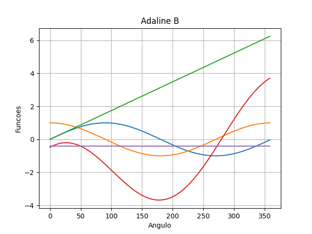
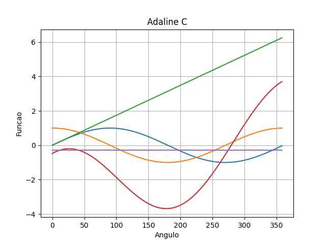
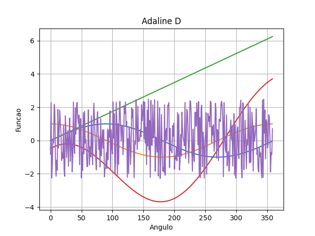
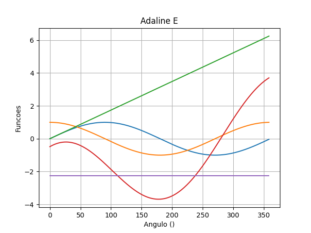
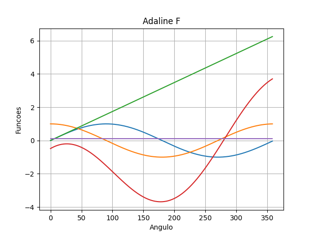

# Trabalho 3 de Inteligência Artificial – Manha

| NOME                               | MATRICULA     |
| ---------------------------------- | ------------- |
| Fabricio Baptista de Castro        | 0050481821007 |
| Mario Celso Zanin                  | 0050481921023 |
---

## Código A

```python
from __future__ import division

import math

import matplotlib.pyplot as plt
import numpy as np
from linear_algebra import dot


def saida_adaline(pesos, entradas):
    y = dot(pesos, entradas)
    return y


def linear(sinapses):
    pesos_sinapses = sinapses
    taxa_aprendizagem = 0.1
    termo_proporcionalidade = 1
    seno = [i for i in range(45)]
    coseno = [i for i in range(45)]
    coeficiente = [i for i in range(45)]
    entradas = [i for i in range(45)]
    saida_parcial = [i for i in range(45)]

    for x in range(45):
        f[x] = -math.pi + 0.565 * math.sin(math.pi/180 * x) + 2.657 * math.cos(
            math.pi/180 * x) + 0.674 * math.pi/180 * x
        seno[x] = math.sin(math.pi/180*x)
        coseno[x] = math.cos(math.pi/180*x)
        coeficiente[x] = math.pi/180*x
        entradas[x] = [termo_proporcionalidade,
                       seno[x], coseno[x], coeficiente[x]]
        saida_parcial[x] = saida_adaline(pesos_sinapses, entradas[x])
        pesos_sinapses[0] = pesos_sinapses[0] + taxa_aprendizagem * \
            ((f[x] - saida_parcial[x])*(f[x] - saida_parcial[x])) * \
            0.5 * termo_proporcionalidade
        pesos_sinapses[1] = pesos_sinapses[1] + taxa_aprendizagem * \
            ((f[x] - saida_parcial[x])*(f[x] - saida_parcial[x])) * \
            0.5 * math.sin(math.pi/180 * x)
        pesos_sinapses[2] = pesos_sinapses[2] + taxa_aprendizagem * \
            ((f[x] - saida_parcial[x])*(f[x] - saida_parcial[x])) * \
            0.5 * math.cos(math.pi/180 * x)
        pesos_sinapses[3] = pesos_sinapses[3] + taxa_aprendizagem * \
            ((f[x] - saida_parcial[x])*(f[x] - saida_parcial[x])) * \
            0.5 * math.pi/180 * x

    return pesos_sinapses, saida_parcial


def teste_generalizacao(sinapses):
    pesos_sinapses = sinapses

    termo_proporcionalidade = 1
    seno = [i for i in range(359)]
    coseno = [i for i in range(359)]
    coeficiente = [i for i in range(359)]
    entradas = [i for i in range(359)]
    saida_parcial = [i for i in range(359)]

    for x in range(359):
        f[x] = -math.pi + 0.565 * (math.sin(math.pi/180))*0.8 + 2.657 * \
            (math.cos(math.pi/180))*0.9 + 0.674 * (math.pi/180)*1.1
        seno[x] = (math.sin(math.pi/180))*0.8
        coseno[x] = (math.cos(math.pi/180))*0.9
        coeficiente[x] = (math.pi/180)*1.1
        entradas[x] = [termo_proporcionalidade,
                       seno[x], coseno[x], coeficiente[x]]
        saida_parcial[x] = saida_adaline(pesos_sinapses, entradas[x])

    saida = saida_parcial
    return sinapses, saida


t = np.arange(0, 359, 1)
seno_0 = 0 + np.sin(np.pi/180 * t)
coseno_0 = 0 + np.cos(np.pi/180 * t)
coeficiente_0 = 0 + np.pi/180 * t

f = -np.pi + 0.565 * seno_0 + 2.657 * coseno_0 + 0.674 * coeficiente_0
neuronio = [-2.4013, 0.393, 1.902, 0.429]

for _ in range(20):
    neuronio, funcao_saida = linear(neuronio)
    print(neuronio)

fig, ax = plt. subplots()
ax.plot(t, seno_0)
ax.plot(t, coseno_0)
ax.plot(t, coeficiente_0)
ax.plot(t, f)
ax.set(xlabel='Angulo', ylabel='Funcoes', title='Adeline A')
ax.grid()
fig.savefig("./tp3/img/adaline_A.png")
neuronio, funcao = teste_generalizacao(neuronio)
ax.plot(t, funcao)
plt.show()
fig.savefig("./tp3/img/adaline_A_1.png")
```
## Console A

```powershell
PS D:\workspace\IA> & C:/Users/bapti/AppData/Local/Programs/Python/Python310/python.exe d:/workspace/IA/tp3/tp3.py
[-2.384257896837099, 0.4002010569615759, 1.9171541526256302, 0.4365579909511697]
[-2.375713185987777, 0.4040494644421408, 1.9246610574519638, 0.4406048232734468]  
[-2.3704176085716337, 0.4064613924421921, 1.9292974418635058, 0.44314331006707186]
[-2.3666928620958925, 0.4081106135809584, 1.932569135560515, 0.44487958079701295] 
[-2.3638324351436437, 0.4092990360912768, 1.9351035428282506, 0.44613055770560145]
[-2.3614837769244024, 0.41018391201543225, 1.937211386426462, 0.44706148886607494]
[-2.3594477295104896, 0.4108562733048119, 1.9390673901161979, 0.44776809826019126]
[-2.357599275426085, 0.41137334607351933, 1.9407811618970883, 0.44831057827274107]
[-2.3558512955808655, 0.41177383713226867, 1.9424294388478696, 0.44872963518758496]
[-2.35413562544991, 0.4120860125628946, 1.944072903197295, 0.4490549737863405]
[-2.352391415120955, 0.4123325453757774, 1.9457665457643556, 0.4493103895061998]
[-2.350556108640622, 0.41253401209884244, 1.947567775009176, 0.4495174402203246]
[-2.348556026410302, 0.4127122078701474, 1.9495449835020602, 0.44969892565866987]
[-2.346293335623709, 0.4128944542361095, 1.9517894793275545, 0.449883408734274]
[-2.3436239519822224, 0.4131208515535026, 1.9544357218874913, 0.45011283326606644]
[-2.3403142512151236, 0.4134589038137204, 1.9577007904780412, 0.450457905140267]
[-2.3359446700282898, 0.41403763886678907, 1.9619716764705593, 0.45105403408128286]
[-2.3296606779121274, 0.4151408706637388, 1.9680287867997617, 0.4521997615845962]
[-2.319382669108915, 0.4175234906158972, 1.9777468393392166, 0.45469137845192825]
[-2.298311523848835, 0.42393396595697963, 1.997142099126486, 0.46143930778130315]
PS D:\workspace\IA> 
```

## Gráfico A


---
---

## Código B

```python
from __future__ import division

import math
import random

import matplotlib.pyplot as plt
import numpy as np
from linear_algebra import dot


def saida_adaline(pesos, entradas):
    y = dot(pesos, entradas)
    return y


def linear(sinapses):
    pesos_sinapses = sinapses
    taxa_aprendizagem = 0.09
    termo_proporcionalidade = 1
    seno = [i for i in range(45)]
    coseno = [i for i in range(45)]
    coeficiente = [i for i in range(45)]
    entradas = [i for i in range(45)]
    saida_parcial = [i for i in range(45)]

    for x in range(45):
        f[x] = -math.pi + 0.555 * math.sin(math.pi/180 * x) + 2.657 * math.cos(
            math.pi/180 * x) + 0.674 * math.pi/180 * x
        seno[x] = math.sin(math.pi/180*x)
        coseno[x] = math.cos(math.pi/180*x)
        coeficiente[x] = math.pi/180*x
        entradas[x] = [termo_proporcionalidade,
                       seno[x], coseno[x], coeficiente[x]]
        saida_parcial[x] = saida_adaline(pesos_sinapses, entradas[x])
        pesos_sinapses[0] = pesos_sinapses[0] + taxa_aprendizagem * \
            ((f[x] - saida_parcial[x])*(f[x] - saida_parcial[x])) * \
            0.5 * termo_proporcionalidade
        pesos_sinapses[1] = pesos_sinapses[1] + taxa_aprendizagem * \
            ((f[x] - saida_parcial[x])*(f[x] - saida_parcial[x])) * \
            0.5 * math.sin(math.pi/180 * x)
        pesos_sinapses[2] = pesos_sinapses[2] + taxa_aprendizagem * \
            ((f[x] - saida_parcial[x])*(f[x] - saida_parcial[x])) * \
            0.5 * math.cos(math.pi/180 * x)
        pesos_sinapses[3] = pesos_sinapses[3] + taxa_aprendizagem * \
            ((f[x] - saida_parcial[x])*(f[x] - saida_parcial[x])) * \
            0.5 * math.pi/180 * x

    return pesos_sinapses, saida_parcial


def teste_generalizacao(sinapses):
    pesos_sinapses = sinapses
    termo_proporcionalidade = 1
    seno = [i for i in range(359)]
    coseno = [i for i in range(359)]
    coeficiente = [i for i in range(359)]
    entradas = [i for i in range(359)]
    saida_parcial = [i for i in range(359)]

    for x in range(359):
        f[x] = -math.pi + 0.565 * (math.sin(math.pi/180)) + 2.657 * (
            math.cos(math.pi/180)) + 0.674 * (math.pi/180) * random.random()
        seno[x] = (math.sin(math.pi/180))
        coseno[x] = (math.cos(math.pi/180))
        coeficiente[x] = (math.pi/180) * random.random()
        entradas[x] = [termo_proporcionalidade,
                       seno[x], coseno[x], coeficiente[x]]
        saida_parcial[x] = saida_adaline(pesos_sinapses, entradas[x])

    saida = saida_parcial
    return sinapses, saida


t = np.arange(0, 359, 1)
seno_0 = 0 + np.sin(np.pi/180 * t)
coseno_0 = 0 + np.cos(np.pi/180 * t)
coeficiente_0 = 0 + np.pi/180 * t

f = -np.pi + 0.565 * seno_0 + 2.657 * coseno_0 + 0.674 * coeficiente_0
neuronio = [-2.8013, 0.393, 1.902, 0.429]

for _ in range(30):
    neuronio, funcao_saida = linear(neuronio)
    print(neuronio)

fig, ax = plt. subplots()
ax.plot(t, seno_0)
ax.plot(t, coseno_0)
ax.plot(t, coeficiente_0)
ax.plot(t, f)
ax.set(xlabel='Angulo', ylabel='Funcoes', title='Adaline B')
ax.grid()
fig.savefig("./tp3/img/adaline_B.png")
neuronio, funcao = teste_generalizacao(neuronio)
ax.plot(t, funcao)
plt.show()
fig.savefig("./tp3/img/adaline_B_1.png")
```

## Console B

```powershell
PS D:\workspace\IA> & C:/Users/bapti/AppData/Local/Programs/Python/Python310/python.exe d:/workspace/IA/tp3/tp3_B.py
[-2.633388540013345, 0.4369516591280898, 2.0603841158014844, 0.47459941553144586]
[-2.6038998274222123, 0.4476972733336838, 2.0871983779103704, 0.48584034590655056]
[-2.591437890981863, 0.4527124198502315, 2.0983665901540283, 0.49109867452720085]
[-2.58449469726033, 0.455658862632152, 2.1045372419154793, 0.49419094833474614]
[-2.5800277083831453, 0.457613578971796, 2.1084873315405996, 0.49624326020536585]
[-2.5768824559556744, 0.45901127539187353, 2.1112613639339526, 0.4977109241127103]
[-2.5745241567429553, 0.46006236006810103, 2.1133400281682095, 0.4988145627386632]
[-2.5726708932745264, 0.46088163933475707, 2.114975389907717, 0.49967464617121937]
[-2.5711597916916427, 0.4615373549122053, 2.116312429356052, 0.5003628216605294]
[-2.5698900373604494, 0.4620727738110189, 2.1174405429275445, 0.5009245338378596]
[-2.568795742807316, 0.4625167520126506, 2.118417964879113, 0.5013901002640431]
[-2.5678318823682598, 0.46288933896505946, 2.1192843829245405, 0.5017805907108963]
[-2.5669664923945392, 0.4632049486737115, 2.1200679123284534, 0.5021111551913335]
[-2.566176100601756, 0.4634742510121862, 2.1207891714058955, 0.5023930095846018]
[-2.5654429197038717, 0.46370535085902753, 2.121463777790218, 0.5026346739400854]
[-2.5647530521297566, 0.46390455200980674, 2.1221039420723224, 0.5028427749169602]
[-2.5640952970818, 0.4640768694927498, 2.122719525116425, 0.5030225840449426]
[-2.563460327384893, 0.4642263846254731, 2.123318767026399, 0.5031783908196791]
[-2.5628400978806516, 0.4643564994948781, 2.123908811182981, 0.5033137701406128]
[-2.5622273994197924, 0.46447012633507406, 2.1244960999909432, 0.5034317813438153]
[-2.5616155021442713, 0.46456983504157007, 2.125086692532575, 0.5035351232380468]
[-2.5609978484792224, 0.46465797497099814, 2.125686539453877, 0.5036262621103235]
[-2.5603677650608048, 0.4647367832442575, 2.126301742638388, 0.5037075455403899]
[-2.5597181661526207, 0.4648084899938654, 2.1269388243667664, 0.5037813129996181]
[-2.5590412198449157, 0.46487543096949424, 2.1276050319271618, 0.5038500141861024]
[-2.558327942180995, 0.46494017969335516, 2.128308709320317, 0.5039163479229651]
[-2.5575676716968405, 0.4650057154850862, 2.1290597792626023, 0.503983438797697]
[-2.5567473541365047, 0.465075651422032, 2.129870399340822, 0.5040550768847506]
[-2.555850527336789, 0.4651545602149695, 2.1307558921993075, 0.5041360605622797]
[-2.5548558258319267, 0.4652484611272247, 2.1317361132820873, 0.5042327089541789]
PS D:\workspace\IA> 
```

## Gráfico B



---

---

## Código C

```python

from __future__ import division

import math
import random

import matplotlib.pyplot as plt
import numpy as np
from linear_algebra import dot


def saida_adaline(pesos, entradas):
    y = dot(pesos, entradas)
    return y


def linear(sinapses):
    pesos_sinapses = sinapses
    taxa_aprendizagem = 0.1
    trm_proporcionalidade = 1
    seno = [i for i in range(45)]
    coseno = [i for i in range(45)]
    coeficiente = [i for i in range(45)]
    entradas = [i for i in range(45)]
    saida_parcial = [i for i in range(45)]

    for i in range(45):
        f[i] = -math.pi + 0.565 * math.sin(math.pi / 180 * i) + 2.657 * math.cos(
            math.pi / 180 * i) + 0.674 * math.pi / 180 * i
        seno[i] = math.sin(math.pi / 180 * i)
        coseno[i] = math.cos(math.pi / 180 * i)
        coeficiente[i] = math.pi / 180 * i
        entradas[i] = [trm_proporcionalidade, seno[i], coseno[i], coeficiente[i]]
        saida_parcial[i] = saida_adaline(pesos_sinapses, entradas[i])
        pesos_sinapses[0] = pesos_sinapses[0] + taxa_aprendizagem * (
                (f[i] - saida_parcial[i]) * (f[i] - saida_parcial[i])) * 0.5 * trm_proporcionalidade
        pesos_sinapses[1] = pesos_sinapses[1] + taxa_aprendizagem * (
                (f[i] - saida_parcial[i]) * (f[i] - saida_parcial[i])) * 0.5 * math.sin(math.pi / 180 * i)
        pesos_sinapses[2] = pesos_sinapses[2] + taxa_aprendizagem * (
                (f[i] - saida_parcial[i]) * (f[i] - saida_parcial[i])) * 0.5 * math.cos(math.pi / 180 * i)
        pesos_sinapses[3] = pesos_sinapses[3] + taxa_aprendizagem * (
                (f[i] - saida_parcial[i]) * (f[i] - saida_parcial[i])) * 0.5 * math.pi / 180 * i

    return pesos_sinapses, saida_parcial


def teste_generalizacao(sinapses):
    pesos_sinapses = sinapses

    trm_proporcionalidade = 1
    seno = [i for i in range(359)]
    coseno = [i for i in range(359)]
    coeficiente = [i for i in range(359)]
    entradas = [i for i in range(359)]
    saida_parcial = [i for i in range(359)]

    for i in range(359):
        f[i] = -math.pi + 0.565 * (math.sin(math.pi / 180)) + 2.657 * (math.cos(math.pi / 180)) + 0.674 * (
                math.pi / 180) * random.random()
        seno[i] = (math.sin(math.pi / 180))
        coseno[i] = (math.cos(math.pi / 180))
        coeficiente[i] = (math.pi / 180) * random.random() * 2.4
        entradas[i] = [trm_proporcionalidade, seno[i], coseno[i], coeficiente[i]]
        saida_parcial[i] = saida_adaline(pesos_sinapses, entradas[i])

    saida = saida_parcial
    return sinapses, saida


t = np.arange(0, 359, 1)
seno_0 = 0 + np.sin(np.pi / 180 * t)
coseno_0 = 0 + np.cos(np.pi / 180 * t)
coeficiente_0 = 0 + np.pi / 180 * t
trm_proporcionalidade = 1
f = -np.pi + 0.565 * seno_0 + 2.657 * coseno_0 + 0.674 * coeficiente_0
neuronio = [-2.4013, 0.393, 1.902, 0.429]

for _ in range(20):
    neuronio, funcao_saida = linear(neuronio)
    print(neuronio)

fig, ax = plt.subplots()
ax.plot(t, seno_0)
ax.plot(t, coseno_0)
ax.plot(t, coeficiente_0)
ax.plot(t, f)
ax.set(xlabel='Angulo', ylabel='Funcao', title='Adaline C')
ax.grid()
fig.savefig("./tp3/img/adaline_C.png")
neuronio, funcao = teste_generalizacao(neuronio)
ax.plot(t, funcao)
plt.show()
fig.savefig("./tp3/img/adaline_C_1.png")
```
## Console C

```powershell
PS D:\workspace\IA> & C:/Users/bapti/AppData/Local/Programs/Python/Python310/python.exe d:/workspace/IA/tp3/tp3_c.py
[-2.384257896837099, 0.4002010569615759, 1.9171541526256302, 0.4365579909511697]
[-2.375713185987777, 0.4040494644421408, 1.9246610574519638, 0.4406048232734468]   
[-2.3704176085716337, 0.4064613924421921, 1.9292974418635058, 0.44314331006707186] 
[-2.3666928620958925, 0.4081106135809584, 1.932569135560515, 0.44487958079701295]  
[-2.3638324351436437, 0.4092990360912768, 1.9351035428282506, 0.44613055770560145] 
[-2.3614837769244024, 0.41018391201543225, 1.937211386426462, 0.44706148886607494] 
[-2.3594477295104896, 0.4108562733048119, 1.9390673901161979, 0.44776809826019126] 
[-2.357599275426085, 0.41137334607351933, 1.9407811618970883, 0.44831057827274107] 
[-2.3558512955808655, 0.41177383713226867, 1.9424294388478696, 0.44872963518758496]
[-2.35413562544991, 0.4120860125628946, 1.944072903197295, 0.4490549737863405]     
[-2.352391415120955, 0.4123325453757774, 1.9457665457643556, 0.4493103895061998]   
[-2.350556108640622, 0.41253401209884244, 1.947567775009176, 0.4495174402203246]   
[-2.348556026410302, 0.4127122078701474, 1.9495449835020602, 0.44969892565866987]  
[-2.346293335623709, 0.4128944542361095, 1.9517894793275545, 0.449883408734274]    
[-2.3436239519822224, 0.4131208515535026, 1.9544357218874913, 0.45011283326606644] 
[-2.3403142512151236, 0.4134589038137204, 1.9577007904780412, 0.450457905140267]   
[-2.3359446700282898, 0.41403763886678907, 1.9619716764705593, 0.45105403408128286]
[-2.3296606779121274, 0.4151408706637388, 1.9680287867997617, 0.4521997615845962]
[-2.319382669108915, 0.4175234906158972, 1.9777468393392166, 0.45469137845192825]
[-2.298311523848835, 0.42393396595697963, 1.997142099126486, 0.46143930778130315]
PS D:\workspace\IA> 
```

## Gráfico C



---

---

## Código D

```python
from __future__ import division

import math
import random as rdm

import matplotlib.pyplot as plt
import numpy as np
from linear_algebra import dot


def saida_adaline(pesos, entradas):
    y = dot(pesos, entradas)
    return y


def linear(sinapses):
    pesos_sinapses = sinapses
    taxa_aprendizagem = 0.1
    termo_proporcionalidade = 1
    seno = [i for i in range(45)]
    coseno = [i for i in range(45)]
    coeficiente = [i for i in range(45)]
    entradas = [i for i in range(45)]
    saida_parcial = [i for i in range(45)]

    for i in range(45):
        f[i] = -math.pi + 0.565 * math.sin(math.pi / 180 * i) + 2.657 * math.cos(
            math.pi / 180 * i) + 0.674 * math.pi / 180 * i
        seno[i] = math.sin(math.pi / 180 * i)
        coseno[i] = math.cos(math.pi / 180 * i)
        coeficiente[i] = math.pi / 180 * i
        entradas[i] = [termo_proporcionalidade, seno[i], coseno[i], coeficiente[i]]
        saida_parcial[i] = saida_adaline(pesos_sinapses, entradas[i])
        pesos_sinapses[0] = pesos_sinapses[0] + taxa_aprendizagem * (
                    (f[i] - saida_parcial[i]) * (f[i] - saida_parcial[i])) * 0.5 * termo_proporcionalidade
        pesos_sinapses[1] = pesos_sinapses[1] + taxa_aprendizagem * (
                    (f[i] - saida_parcial[i]) * (f[i] - saida_parcial[i])) * 0.5 * math.sin(math.pi / 180 * i)
        pesos_sinapses[2] = pesos_sinapses[2] + taxa_aprendizagem * (
                    (f[i] - saida_parcial[i]) * (f[i] - saida_parcial[i])) * 0.5 * math.cos(math.pi / 180 * i)
        pesos_sinapses[3] = pesos_sinapses[3] + taxa_aprendizagem * (
                    (f[i] - saida_parcial[i]) * (f[i] - saida_parcial[i])) * 0.5 * math.pi / 180 * i

    return pesos_sinapses, saida_parcial


def teste_generalizacao(sinapses):
    pesos_sinapses = sinapses
    termo_proporcionalidade = 1
    seno = [i for i in range(359)]
    coseno = [i for i in range(359)]
    coeficiente = [i for i in range(359)]
    entradas = [i for i in range(359)]
    saida_parcial = [i for i in range(359)]

    for i in range(359):
        f[i] = -math.pi + 0.565 * (math.sin(math.pi / 180)) + 2.657 * (
            math.cos(math.pi / 180)) * rdm.random() * 2.4 + 0.674 * (math.pi / 180)
        seno[i] = (math.sin(math.pi / 180))
        coseno[i] = (math.cos(math.pi / 180)) * rdm.random() * 2.4
        coeficiente[i] = (math.pi / 180)
        entradas[i] = [termo_proporcionalidade, seno[i], coseno[i], coeficiente[i]]
        saida_parcial[i] = saida_adaline(pesos_sinapses, entradas[i])

    saida = saida_parcial
    return sinapses, saida


t = np.arange(0, 359, 1)
seno_0 = 0 + np.sin(np.pi / 180 * t)
coseno_0 = 0 + np.cos(np.pi / 180 * t)
coeficiente_0 = 0 + np.pi / 180 * t
f = -np.pi + 0.565 * seno_0 + 2.657 * coseno_0 + 0.674 * coeficiente_0
neuronio = [-2.4013, 0.393, 1.902, 0.429]

for x in range(20):
    neuronio, funcao_saida = linear(neuronio)
    print(neuronio)

fig, ax = plt.subplots()
ax.plot(t, seno_0)
ax.plot(t, coseno_0)
ax.plot(t, coeficiente_0)
ax.plot(t, f)
ax.set(xlabel='Angulo', ylabel='Funcao', title='Adaline D')
ax.grid()
fig.savefig("./tp3/img/adaline_D.png")
neuronio, funcao = teste_generalizacao(neuronio)
ax.plot(t, funcao)
plt.show()
fig.savefig("./tp3/img/adaline_D_1.png")
```

## Console D

```powershell

PS D:\workspace\IA> & C:/Users/bapti/AppData/Local/Programs/Python/Python310/python.exe d:/workspace/IA/tp3/tp3_d.py
[-2.384257896837099, 0.4002010569615759, 1.9171541526256302, 0.4365579909511697]
[-2.375713185987777, 0.4040494644421408, 1.9246610574519638, 0.4406048232734468]   
[-2.3704176085716337, 0.4064613924421921, 1.9292974418635058, 0.44314331006707186] 
[-2.3666928620958925, 0.4081106135809584, 1.932569135560515, 0.44487958079701295]  
[-2.3638324351436437, 0.4092990360912768, 1.9351035428282506, 0.44613055770560145] 
[-2.3614837769244024, 0.41018391201543225, 1.937211386426462, 0.44706148886607494] 
[-2.3594477295104896, 0.4108562733048119, 1.9390673901161979, 0.44776809826019126] 
[-2.357599275426085, 0.41137334607351933, 1.9407811618970883, 0.44831057827274107] 
[-2.3558512955808655, 0.41177383713226867, 1.9424294388478696, 0.44872963518758496]
[-2.35413562544991, 0.4120860125628946, 1.944072903197295, 0.4490549737863405]     
[-2.352391415120955, 0.4123325453757774, 1.9457665457643556, 0.4493103895061998]   
[-2.350556108640622, 0.41253401209884244, 1.947567775009176, 0.4495174402203246]   
[-2.348556026410302, 0.4127122078701474, 1.9495449835020602, 0.44969892565866987]  
[-2.346293335623709, 0.4128944542361095, 1.9517894793275545, 0.449883408734274]    
[-2.3436239519822224, 0.4131208515535026, 1.9544357218874913, 0.45011283326606644] 
[-2.3403142512151236, 0.4134589038137204, 1.9577007904780412, 0.450457905140267]   
[-2.3359446700282898, 0.41403763886678907, 1.9619716764705593, 0.45105403408128286]
[-2.3296606779121274, 0.4151408706637388, 1.9680287867997617, 0.4521997615845962]  
[-2.319382669108915, 0.4175234906158972, 1.9777468393392166, 0.45469137845192825]  
[-2.298311523848835, 0.42393396595697963, 1.997142099126486, 0.46143930778130315]
PS D:\workspace\IA> 
```

## Gráfico D



---

---

## Código E

```python
from __future__ import division

import math

import matplotlib.pyplot as plt
import numpy as np
from linear_algebra import dot


def saida_adaline(pesos, entradas):
    y = dot(pesos, entradas)
    return y


def linear(sinapses):
    pesos_sinapses = sinapses
    taxa_aprendizagem = 0.1
    termo_proporcionalidade = 1
    seno = [i for i in range(45)]
    coseno = [i for i in range(45)]
    coeficiente = [i for i in range(45)]
    entradas = [i for i in range(45)]
    saida_parcial = [i for i in range(45)]

    for x in range(45):
        f[x] = -math.pi + 0.565 * math.sin(math.pi / 180 * x) + 2.657 * \
            math.cos(math.pi / 180 * x) + 0.674 * math.pi / 180 * x
        seno[x] = math.sin(math.pi / 180*x)
        coseno[x] = math.cos(math.pi / 180*x)
        coeficiente[x] = math.pi / 180 * x
        entradas[x] = [termo_proporcionalidade,
                       seno[x], coseno[x], coeficiente[x]]
        saida_parcial[x] = saida_adaline(pesos_sinapses, entradas[x])
        pesos_sinapses[0] = pesos_sinapses[0] + taxa_aprendizagem * \
            ((f[x] - saida_parcial[x]) * (f[x] - saida_parcial[x])) * \
            0.5 * termo_proporcionalidade
        pesos_sinapses[1] = pesos_sinapses[1] + taxa_aprendizagem * \
            ((f[x] - saida_parcial[x]) * (f[x] - saida_parcial[x])) * \
            0.5 * math.sin(math.pi / 180 * x)
        pesos_sinapses[2] = pesos_sinapses[2] + taxa_aprendizagem * \
            ((f[x] - saida_parcial[x]) * (f[x] - saida_parcial[x])) * \
            0.5 * math.cos(math.pi / 180 * x)
        pesos_sinapses[3] = pesos_sinapses[3] + taxa_aprendizagem * \
            ((f[x] - saida_parcial[x]) * (f[x] - saida_parcial[x])) * \
            0.5 * math.pi / 180 * x

    return pesos_sinapses, saida_parcial


def teste_generalização(sinapses):
    pesos_sinapses = sinapses

    termo_proporcionalidade = 1
    seno = [i for i in range(359)]
    coseno = [i for i in range(359)]
    coeficiente = [i for i in range(359)]
    entradas = [i for i in range(359)]
    saida_parcial = [i for i in range(359)]

    for x in range(359):
        f[x] = -math.pi + 0.565 * (math.sin(math.pi / 180)) \
            * (math.cos(math.pi / 180) * 1.3) + 2.657 * (math.cos(math.pi / 180)) \
            * (math.sin(math.pi / 180) * 1.2) + 0.674 * (math.pi / 180) * 0.8

        seno[x] = (math.sin(math.pi / 180)) * (math.cos(math.pi / 180) * 1.3)
        coseno[x] = (math.cos(math.pi / 180)) * (math.sin(math.pi/180) * 1.2)
        coeficiente[x] = (math.pi / 180) * 0.8
        entradas[x] = [termo_proporcionalidade,
                       seno[x], coseno[x], coeficiente[x]]
        saida_parcial[x] = saida_adaline(pesos_sinapses, entradas[x])

    saida = saida_parcial
    return sinapses, saida


t = np.arange(0, 359, 1)
seno_0 = 0 + np.sin(np.pi/180 * t)
coseno_0 = 0 + np.cos(np.pi/180 * t)
coeficiente_0 = 0 + np.pi/180 * t
f = -np.pi + 0.565 * seno_0 + 2.657 * coseno_0 + 0.674 * coeficiente_0

neuronio = [-2.4013, 0.393, 1.902, 0.429]

for _ in range(20):
    neuronio, função_saida = linear(neuronio)
    print(neuronio)


fig, ax = plt. subplots()
ax.plot(t, seno_0)
ax.plot(t, coseno_0)
ax.plot(t, coeficiente_0)
ax.plot(t, f)
ax.set(xlabel='Angulo ()', ylabel='Funcoes', title='Adaline E')
ax.grid()

fig.savefig("adaline_E.png")
neuronio, função = teste_generalização(neuronio)
ax.plot(t, função)
plt.show()
fig.savefig("adaline_E_1.png")
```

## Console E

```powershell

PS D:\workspace\IA> & C:/Users/bapti/AppData/Local/Programs/Python/Python310/python.exe d:/workspace/IA/tp3/tp3_e.py
[-2.384257896837099, 0.4002010569615759, 1.9171541526256302, 0.4365579909511697]
[-2.375713185987777, 0.4040494644421408, 1.9246610574519638, 0.4406048232734468]  
[-2.3704176085716337, 0.4064613924421921, 1.9292974418635058, 0.44314331006707186]
[-2.3666928620958925, 0.4081106135809584, 1.932569135560515, 0.44487958079701295]
[-2.3638324351436437, 0.4092990360912768, 1.9351035428282506, 0.44613055770560145]
[-2.3614837769244024, 0.41018391201543225, 1.937211386426462, 0.44706148886607494]
[-2.3594477295104896, 0.4108562733048119, 1.9390673901161979, 0.44776809826019126]
[-2.357599275426085, 0.41137334607351933, 1.9407811618970883, 0.44831057827274107]
[-2.3558512955808655, 0.41177383713226867, 1.9424294388478696, 0.44872963518758496]
[-2.35413562544991, 0.4120860125628946, 1.944072903197295, 0.4490549737863405]
[-2.352391415120955, 0.4123325453757774, 1.9457665457643556, 0.4493103895061998]
[-2.350556108640622, 0.41253401209884244, 1.947567775009176, 0.4495174402203246]
[-2.348556026410302, 0.4127122078701474, 1.9495449835020602, 0.44969892565866987]
[-2.346293335623709, 0.4128944542361095, 1.9517894793275545, 0.449883408734274]
[-2.3436239519822224, 0.4131208515535026, 1.9544357218874913, 0.45011283326606644]
[-2.3403142512151236, 0.4134589038137204, 1.9577007904780412, 0.450457905140267]
[-2.3359446700282898, 0.41403763886678907, 1.9619716764705593, 0.45105403408128286]
[-2.3296606779121274, 0.4151408706637388, 1.9680287867997617, 0.4521997615845962]
[-2.319382669108915, 0.4175234906158972, 1.9777468393392166, 0.45469137845192825]
[-2.298311523848835, 0.42393396595697963, 1.997142099126486, 0.46143930778130315]
PS D:\workspace\IA> 
```

## Gráfico E



---

---

## Codigo F

```python
from __future__ import division

import math

import matplotlib.pyplot as plt
import numpy as np
from linear_algebra import dot


def saida_adaline(pesos, entradas):
    y = dot(pesos, entradas)
    return y


def linear(sinapses):
    pesos_sinapses = sinapses
    taxa_aprendizagem = 0.1
    termo_proporcionalidade = 1
    seno = [i for i in range(45)]
    coseno = [i for i in range(45)]
    coeficiente = [i for i in range(45)]
    entradas = [i for i in range(45)]
    saida_parcial = [i for i in range(45)]

    for x in range(45):
        f[x] = -math.pi + 0.565 * math.sin(math.pi/180 * x) + 2.657 * math.cos(math.pi/180 * x) + 0.674 * math.pi/180 * x
        seno[x] = math.sin(math.pi/180 * x)
        coseno[x] = math.cos(math.pi/180 * x)
        coeficiente[x] = math.pi/180 * x
        entradas[x] = [termo_proporcionalidade, seno[x], coseno[x], coeficiente[x]]
        saida_parcial[x] = saida_adaline(pesos_sinapses, entradas[x])
        pesos_sinapses[0] = pesos_sinapses[0] + taxa_aprendizagem * ((f[x] - saida_parcial[x]) * (f[x] - saida_parcial[x])) * 0.5 * termo_proporcionalidade
        pesos_sinapses[1] = pesos_sinapses[1] + taxa_aprendizagem * ((f[x] - saida_parcial[x]) * (f[x] - saida_parcial[x])) * 0.5 * math.sin(math.pi/180 * x)
        pesos_sinapses[2] = pesos_sinapses[2] + taxa_aprendizagem * ((f[x] - saida_parcial[x]) * (f[x] - saida_parcial[x])) * 0.5 * math.cos(math.pi/180 * x)
        pesos_sinapses[3] = pesos_sinapses[3] + taxa_aprendizagem * ((f[x] - saida_parcial[x]) * (f[x] - saida_parcial[x])) * 0.5 * math.pi/180 * x

    return pesos_sinapses, saida_parcial


def teste_generalização(sinapses):
    pesos_sinapses = sinapses

    termo_proporcionalidade = 1
    seno = [i for i in range(359)]
    coseno = [i for i in range(359)]
    coeficiente = [i for i in range(359)]
    entradas = [i for i in range(359)]
    saida_parcial = [i for i in range(359)]

    for x in range(359):
        f[x] = -math.pi + 0.565 * (math.sin(math.pi/180)) * 0.59 + 2.657 * (math.cos(math.pi/180)) * 1.2 + 0.674 * (math.pi/180) * 0.4
        seno[x] = (math.sin(math.pi/180)) * 0.59
        coseno[x] = (math.cos(math.pi/180)) * 1.2
        coeficiente[x] = (math.pi/180) * 0.4
        entradas[x] = [termo_proporcionalidade, seno[x], coseno[x], coeficiente[x]]
        saida_parcial[x] = saida_adaline(pesos_sinapses, entradas[x])

    saida = saida_parcial
    return sinapses, saida

t = np.arange(0, 359, 1)
seno_0 = 0 + np.sin(np.pi/180 * t)
coseno_0 = 0 + np.cos(np.pi/180 * t)
coeficiente_0 = 0 + np.pi/180 * t

f = -np.pi + 0.565 * seno_0 + 2.657 * coseno_0 + 0.674 * coeficiente_0
neuronio = [-2.4013, 0.393, 1.902, 0.429]
for _ in range(20):
    neuronio, função_saida = linear(neuronio)
    print(neuronio)

fig, ax = plt. subplots()
ax.plot(t, seno_0)
ax.plot(t, coseno_0)
ax.plot(t, coeficiente_0)
ax.plot(t, f)
# ax.plot(t,função_saida)
ax.set(xlabel='Angulo', ylabel='Funcoes', title='Adaline F')
ax.grid()

fig.savefig("./tp3/img/adaline_F.png")
neuronio, função = teste_generalização(neuronio)
ax.plot(t, função)
plt.show()
fig.savefig("./tp3/img/adaline_F_1.png")
```

## Console F

```powershell
PS D:\workspace\IA> & C:/Users/bapti/AppData/Local/Programs/Python/Python310/python.exe d:/workspace/IA/tp3/tp3_f.py
[-2.384257896837099, 0.4002010569615759, 1.9171541526256302, 0.4365579909511697]
[-2.375713185987777, 0.4040494644421408, 1.9246610574519638, 0.4406048232734468]   
[-2.3704176085716337, 0.4064613924421921, 1.9292974418635058, 0.44314331006707186] 
[-2.3666928620958925, 0.4081106135809584, 1.932569135560515, 0.44487958079701295]  
[-2.3638324351436437, 0.4092990360912768, 1.9351035428282506, 0.44613055770560145] 
[-2.3614837769244024, 0.41018391201543225, 1.937211386426462, 0.44706148886607494] 
[-2.3594477295104896, 0.4108562733048119, 1.9390673901161979, 0.44776809826019126] 
[-2.357599275426085, 0.41137334607351933, 1.9407811618970883, 0.44831057827274107] 
[-2.3558512955808655, 0.41177383713226867, 1.9424294388478696, 0.44872963518758496]
[-2.35413562544991, 0.4120860125628946, 1.944072903197295, 0.4490549737863405]     
[-2.352391415120955, 0.4123325453757774, 1.9457665457643556, 0.4493103895061998]   
[-2.350556108640622, 0.41253401209884244, 1.947567775009176, 0.4495174402203246]   
[-2.348556026410302, 0.4127122078701474, 1.9495449835020602, 0.44969892565866987]  
[-2.346293335623709, 0.4128944542361095, 1.9517894793275545, 0.449883408734274]    
[-2.3436239519822224, 0.4131208515535026, 1.9544357218874913, 0.45011283326606644] 
[-2.3403142512151236, 0.4134589038137204, 1.9577007904780412, 0.450457905140267]   
[-2.3359446700282898, 0.41403763886678907, 1.9619716764705593, 0.45105403408128286]
[-2.3296606779121274, 0.4151408706637388, 1.9680287867997617, 0.4521997615845962]  
[-2.319382669108915, 0.4175234906158972, 1.9777468393392166, 0.45469137845192825]  
[-2.298311523848835, 0.42393396595697963, 1.997142099126486, 0.46143930778130315]  
PS D:\workspace\IA>  
```

## Gráfico F

---

---

---

## Código G
```python
from __future__ import division

import math

import matplotlib.pyplot as plt
import numpy as np
from linear_algebra import dot


def saida_adaline(pesos, entradas):
    y = dot(pesos, entradas)
    return y


def linear(sinapses):
    pesos_sinapses = sinapses
    taxa_aprendizagem = 0.1
    termo_proporcionalidade = 1
    seno = [i for i in range(45)]
    coseno = [i for i in range(45)]
    coeficiente = [i for i in range(45)]
    entradas = [i for i in range(45)]
    saida_parcial = [i for i in range(45)]

    for x in range(45):
        f[x] = -math.pi + 0.565 * math.sin( math.pi/180 * x) + 2.657 \
            * math.cos( math.pi/180 * x) + 0.674 * math.pi/180 * x
        seno[x] = math.sin( math.pi/180*x)
        coseno[x] = math.cos( math.pi/180*x)
        coeficiente[x] = math.pi/180*x
        entradas[x] = [termo_proporcionalidade, seno[x], coseno[x], coeficiente[x]]
        saida_parcial[x] = saida_adaline(pesos_sinapses, entradas[x])
        pesos_sinapses[0] = pesos_sinapses[0] + taxa_aprendizagem * ((f[x] -
        saida_parcial[x])*(f[x] - saida_parcial[x])) * 0.5 * termo_proporcionalidade
        pesos_sinapses[1] = pesos_sinapses[1] + taxa_aprendizagem * ((f[x] -
        saida_parcial[x])*(f[x] - saida_parcial[x])) * 0.5 * math.sin( math.pi/180 * x)
        pesos_sinapses[2] = pesos_sinapses[2] + taxa_aprendizagem * ((f[x] -
        saida_parcial[x])*(f[x] - saida_parcial[x])) * 0.5 * math.cos( math.pi/180 * x)
        pesos_sinapses[3] = pesos_sinapses[3] + taxa_aprendizagem * ((f[x] -
        saida_parcial[x])*(f[x] - saida_parcial[x])) * 0.5 * math.pi/180 * x

    return pesos_sinapses, saida_parcial

    
def teste_generalização(sinapses):
    pesos_sinapses = sinapses

    termo_proporcionalidade = 1
    seno = [i for i in range(359)]
    coseno = [i for i in range(359)]
    coeficiente = [i for i in range(359)]
    entradas = [i for i in range(359)]
    saida_parcial = [i for i in range(359)]

    for x in range(359):
        f[x] = -math.pi + 0.565 * (math.sin(math.pi/180))*1.5 + 2.657 \
            * (math.cos(math.pi/180))*1.2 + 0.674 * (math.pi/180)*0.4
        seno[x] = (math.sin(math.pi/180))*1.5
        coseno[x] = (math.cos(math.pi/180))*1.2
        coeficiente[x] = (math.pi/180)*0.4
        entradas[x] = [termo_proporcionalidade, seno[x], coseno[x], coeficiente[x]]
        saida_parcial[x] = saida_adaline(pesos_sinapses, entradas[x])

    saida = saida_parcial
    return sinapses, saida

t = np.arange(0, 359, 1)
seno_0 = 0 + np.sin( np.pi/180 * t)
coseno_0 = 0 + np.cos( np.pi/180 * t)
coeficiente_0 = 0 + np.pi/180 * t
f = -np.pi + 0.565 * seno_0 + 2.657 * coseno_0 + 0.674 * coeficiente_0

neuronio = [-2.4013, 0.393, 1.902, 0.429]

for _ in range(20):
    neuronio, função_saida = linear(neuronio)
    print (neuronio)

fig, ax = plt. subplots()
ax.plot(t,seno_0)
ax.plot(t,coseno_0)
ax.plot(t,coeficiente_0)
ax.plot(t,f)

ax.set(xlabel= 'angulo ()', ylabel= 'funcoes', title= 'Adaline G')
ax.grid()
fig.savefig("./tp3/img/adaline_G.png")

neuronio, função = teste_generalização(neuronio)

ax.plot(t, função)
plt.show()
fig.savefig("./tp3/img/adaline_G_1.png")
```

## Console G
```powershell

PS D:\workspace\IA> & C:/Users/bapti/AppData/Local/Programs/Python/Python310/python.exe d:/workspace/IA/tp3/tp3_g.py
[-2.384257896837099, 0.4002010569615759, 1.9171541526256302, 0.4365579909511697]
[-2.375713185987777, 0.4040494644421408, 1.9246610574519638, 0.4406048232734468]   
[-2.3704176085716337, 0.4064613924421921, 1.9292974418635058, 0.44314331006707186] 
[-2.3666928620958925, 0.4081106135809584, 1.932569135560515, 0.44487958079701295]  
[-2.3638324351436437, 0.4092990360912768, 1.9351035428282506, 0.44613055770560145] 
[-2.3614837769244024, 0.41018391201543225, 1.937211386426462, 0.44706148886607494] 
[-2.3594477295104896, 0.4108562733048119, 1.9390673901161979, 0.44776809826019126] 
[-2.357599275426085, 0.41137334607351933, 1.9407811618970883, 0.44831057827274107] 
[-2.3558512955808655, 0.41177383713226867, 1.9424294388478696, 0.44872963518758496]
[-2.35413562544991, 0.4120860125628946, 1.944072903197295, 0.4490549737863405]
[-2.352391415120955, 0.4123325453757774, 1.9457665457643556, 0.4493103895061998]
[-2.350556108640622, 0.41253401209884244, 1.947567775009176, 0.4495174402203246]
[-2.348556026410302, 0.4127122078701474, 1.9495449835020602, 0.44969892565866987]
[-2.346293335623709, 0.4128944542361095, 1.9517894793275545, 0.449883408734274]
[-2.3436239519822224, 0.4131208515535026, 1.9544357218874913, 0.45011283326606644]
[-2.3403142512151236, 0.4134589038137204, 1.9577007904780412, 0.450457905140267]
[-2.3359446700282898, 0.41403763886678907, 1.9619716764705593, 0.45105403408128286]
[-2.3296606779121274, 0.4151408706637388, 1.9680287867997617, 0.4521997615845962]
[-2.319382669108915, 0.4175234906158972, 1.9777468393392166, 0.45469137845192825]
[-2.298311523848835, 0.42393396595697963, 1.997142099126486, 0.46143930778130315]
PS D:\workspace\IA>
```

## Gráfico G

---