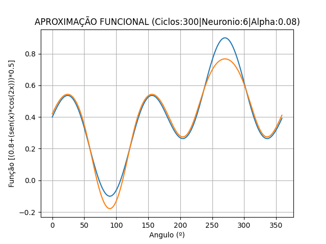
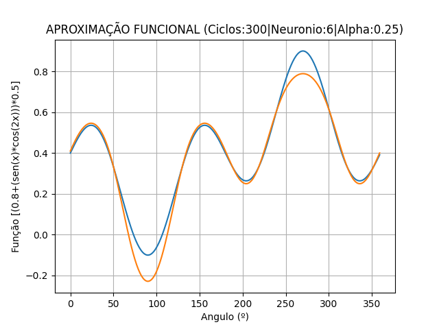

# Trabalho 4 de Inteligência Artificial – Manha

| NOME                               | MATRICULA     |
| ---------------------------------- | ------------- |
| Fabricio Baptista de Castro        | 0050481821007 |
| Mario Celso Zanin                  | 0050481921023 |

---

## Código Base

```python
from __future__ import division

from linear_algebra import dot

import matplotlib.pyplot as plt
import numpy as np
import math
import math, random

def sigmoid(t):
    return ((2 / (1 + math.exp(-t)))-1)

def neuron_output(weights, inputs):
    return sigmoid(dot(weights, inputs))

def feed_forward(neural_network, input_vector):
    outputs = []
    for layer in neural_network:
        input_with_bias = input_vector + [1]             # adiciona bias à entrada
        output = [neuron_output(neuron, input_with_bias) # calcula a saída do neurônio 
                  for neuron in layer]                   # para cada camada
        #print(output)
        outputs.append(output)
        
        # a saída de uma camada de neurônio é a entrada da próxima camada
        input_vector = output
   
    return outputs

alpha = 0.08

def backpropagate(network, input_vector, target):
    # feed_forward calcula a saída dos neurônios usando sigmóide
    hidden_outputs, outputs = feed_forward(network, input_vector)
    # 0.5 *alpha* (1 + output) * (1 - output) cálculo de derivada de sigmóide
    output_deltas = [0.5 * (1 + output) * (1 - output) * (output - target[i]) \ 
                    * alpha for i, output in enumerate(outputs)]
    
    # ajuste dos pesos sinápticos para camadas de saída (network[-1])
    for i, output_neuron in enumerate(network[-1]):
        for j, hidden_output in enumerate(hidden_outputs + [1]):
            output_neuron[j] -= output_deltas[i] * hidden_output
    
    # 0.5 *alpha* (1 +output)*(1-output) cálculo de derivada da sigmóide
    # retro-programação do erro para camadas intermediárias
    hidden_deltas = [ 0.5 * alpha * (1 + hidden_output) * (1 - hidden_output) *
                    dot(output_deltas, [n[i] for n in network[-1]])
                    for i, hidden_output in enumerate(hidden_outputs)]
    
    # ajuste dos pesos sinápticos para camadas intermediárias (network[0])
    for i, hidden_neuron in enumerate(network[0]):
        for j, input in enumerate(input_vector + [1]):
            hidden_neuron[j] -= hidden_deltas[i] * input
 
def seno(x): # função a ser aproximada pela rede neural
       seno = [(math.sin(2*math.pi/180*x)*math.sin(math.pi/180*x))]
       # seno é uma lista
       # [(0.8+(math.sin(math.pi/180*x)*math.sin(2*math.pi/180*x)))*0.5]
       return [seno]
   
def predict(inputs):
     return feed_forward(network, inputs)[-1]

inputs = []
targets = []
for x in range(360):
    seno_a = seno(x)
    
# TREINAMENTO DA REDE NEURAL
random.seed(0)  # valores iniciais de pesos sinápticos
input_size = 1  # dimensão do vetor de entrada
num_hidden = 6  # número de neurônios na camada intermediária
output_size = 1 # dimensão das camadas de saída = 1 neurônio

"""
inserindo manualmente os vetores relativos à camada intermediária e a saída da Rede Neural
hidden_layer = [[-0.085, -0.09], [-0.033, -0.08], [-0.074, -0.063], [-0.075, -0.065], [-0.088, -0.076], [-0.077, -0.072]]
output_layer = [[0.082, -0.09, 0.064, -0.08, 0.084, -0.075, 0.099]] 
"""

# cada neurônio da camada intermediária tem um peso sináptico associado à entrada
# e adicionado o peso do bias
hidden_layer = [[random.random() for __ in range(input_size + 1)]
                for __ in range(num_hidden)]

# neurônio de saída tem um peso sináptico associado a cada neurôio da camada intermediária
# e adicionado o peso do bias
output_layer = [[random.random() for __ in range(num_hidden +1)]
                for __ in range(output_size)]

# a rede inicializa com pesos sinápticos randômicos
network = [hidden_layer, output_layer]

for __ in range(300): # número de ciclos de treinamento
    for x in range(360):
        inputs = seno(x)
        targets = seno(x)
        for input_vector, target_vector in zip(inputs, targets):
            backpropagate(network, input_vector, target_vector)

#TERINAMENTO DA REDE NEURAL
# formação do gráfico
fig, ax = plt.subplots()
ax.set(xlabel='Angulo (º)', ylabel='Função sen(x)*sen(2x)',
       title='APROXIMAÇÃO FUNCIONAL (Ciclos:300|Neuronio:6|Alpha:0.08)')
ax.grid()
t = np.arange(0, 360,1) 

#teste da rede através de predict()
saida = []
for x in range(360):
    inputs = seno(x)
    targets = seno(x)
    for input_vector, target_vector in zip(inputs, targets):
        sinal_saida = predict(input_vector)
        saida.extend(sinal_saida)
        
entrada = []
for x in range(360):
    entrada += seno(x) # criando o arranjo da função de entrada para o gráfico

ax.plot(t, entrada)
ax.plot(t, saida)

print (f'Comando Entrada {hidden_layer}')
print (f'Comando Saída {output_layer}')
   
plt.show()
fig.savefig('aprox_func_base')
```

## Console Base

```python
PS D:\workspace\IA> & C:/Users/bapti/AppData/Local/Programs/Python/Python310/python.exe d:/workspace/IA/tp4/tp4_base.py
Comando Entrada [[0.8316653739793878, 0.7329050252081368], [0.5259674238665503, 0.17441528043000867], [0.574167323963585, 0.33579717189559205], [0.8083944325652158, 0.2322715671875966], [0.544388481227258, 0.49993961909800066], [0.9293839135481552, 0.3288285099918328]]
Comando Saída [[0.5159123008913119, 1.3385546898770193, 1.1065368272535148, 1.161079791736351, 1.1431445370972955, 1.7584206654429932, -1.1827560941405195]]
PS D:\workspace\IA>
```

## Gráfico Base


---
---

## Código tp4_1a

```python
from __future__ import division

import math
import random

import matplotlib.pyplot as plt
import numpy as np
from linear_algebra import dot


def sigmoid(t):
    return ((2 / (1 + math.exp(-t)))-1)

def neuron_output(weights, inputs):
    return sigmoid(dot(weights, inputs))

def feed_forward(neural_network, input_vector):
    outputs = []
    for layer in neural_network:
        input_with_bias = input_vector + [1]             # adiciona bias à entrada
        output = [neuron_output(neuron, input_with_bias) # calcula a saída do neurônio 
                  for neuron in layer]                   # para cada camada
        #print(output)
        outputs.append(output)
        
        # a saída de uma camada de neurônio é a entrada da próxima camada
        input_vector = output
   
    return outputs

alpha = 0.08

def backpropagate(network, input_vector, target):
    # feed_forward calcula a saída dos neurônios usando sigmóide
    hidden_outputs, outputs = feed_forward(network, input_vector)
    # 0.5 *alpha* (1 + output) * (1 - output) cálculo de derivada de sigmóide
    output_deltas = [0.5 * (1 + output) * (1 - output) * (output - target[i]) * alpha
                     for i, output in enumerate(outputs)]
    
    # ajuste dos pesos sinápticos para camadas de saída (network[-1])
    for i, output_neuron in enumerate(network[-1]):
        for j, hidden_output in enumerate(hidden_outputs + [1]):
            output_neuron[j] -= output_deltas[i] * hidden_output
    
    # 0.5 *alpha* (1 +output)*(1-output) cálculo de derivada da sigmóide
    # retro-programação do erro para camadas intermediárias
    hidden_deltas = [ 0.5 * alpha * (1 + hidden_output) * (1 - hidden_output) *
                      dot(output_deltas, [n[i] for n in network[-1]])
                     for i, hidden_output in enumerate(hidden_outputs)]
    
    # ajuste dos pesos sinápticos para camadas intermediárias (network[0])
    for i, hidden_neuron in enumerate(network[0]):
        for j, input in enumerate(input_vector + [1]):
            hidden_neuron[j] -= hidden_deltas[i] * input
 
def seno(x): # função a ser aproximada pela rede neural
       seno = [(math.sin(2*math.pi/180*x)*math.sin(math.pi/180*x))]
       # seno é uma lista
       # [(0.8+(math.sin(math.pi/180*x)*math.sin(2*math.pi/180*x)))*0.5]
       return [seno]
   
def predict(inputs):
     return feed_forward(network, inputs)[-1]

inputs = []
targets = []

for x in range(360):
    seno_a = seno(x)
    
# TREINAMENTO DA REDE NEURAL

random.seed(0) # valores iniciais de pesos sinápticos
input_size = 1 # dimensão do vetor de entrada
num_hidden = 2 # número de neurônios na camada intermediária
output_size = 1 # dimensão das camadas de saída = 1 neurônio

"""
inserindo manualmente os vetores relativos à camada intermediária e a saída da Rede Neural
hidden_layer = [[-0.085, -0.09], [-0.033, -0.08], [-0.074, -0.063], [-0.075, -0.065], [-0.088, -0.076], [-0.077, -0.072]]
output_layer = [[0.082, -0.09, 0.064, -0.08, 0.084, -0.075, 0.099]]
"""

# cada neurônio da camada intermediária tem um peso sináptico associado à entrada
# e adicionado o peso do bias
hidden_layer = [[random.random() for __ in range(input_size + 1)]
                for __ in range(num_hidden)]

# neurônio de saída tem um peso sináptico associado a cada neurôio da camada intermediária
# e adicionado o peso do bias
output_layer = [[random.random() for __ in range(num_hidden +1)]
                for __ in range(output_size)]

# a rede inicializa com pesos sinápticos randômicos
network = [hidden_layer, output_layer]

for __ in range(200):   # número de ciclos de treinamento
    for x in range(360):
        inputs = seno(x)
        targets = seno(x)
        for input_vector, target_vector in zip(inputs, targets):
            backpropagate(network, input_vector, target_vector)

# TREINAMENTO DA REDE NEURAL
# Formação do Gráfico
fig, ax = plt.subplots()
ax.set(xlabel='Angulo (º)', ylabel='Função sen(x)*sen(2x)',
       title='APROXIMAÇÃO FUNCIONAL(Ciclos:200|Neuronios:2|Alpha:0.08)')
ax.grid()
t = np.arange(0, 360,1) 

# Teste da rede através de predict
saida = []

for x in range(360):
    inputs = seno(x)
    targets = seno(x)
    for input_vector, target_vector in zip(inputs, targets):
        sinal_saida = predict(input_vector)
        saida.extend(sinal_saida)
        
entrada = []

for x in range(360):
    entrada += seno(x) # criando o arranjo da função de entrada para o gráfico

ax.plot(t, entrada)
ax.plot(t, saida)

print (f'Comando Entrada {hidden_layer}')
print (f'Comando Saída {output_layer}')

plt.show()
fig.savefig('./img/aprox_func_1a.png')
```

## Console tp4_1a

```powershell
PS D:\workspace\IA> & C:/Users/bapti/AppData/Local/Programs/Python/Python310/python.exe d:/workspace/IA/tp4/tp4_1a.py
comando entrada [[1.0408393883858735, 0.4525690083234288], [0.7524377929122791, 0.1291888136629787]]
comando saída [[3.047923627308438, 2.435423673493166, -0.8289472821150731]]
PS D:\workspace\IA> 
```

## Gráfico tp4_1a


---
---

## Código tp4_1b

```python
from __future__ import division

import math  # pg 56 - Summerfield
import random

import matplotlib.pyplot as plt
import numpy as np
from linear_algebra import dot


def sigmoid(t):
    return ((2 / (1 + math.exp(-t)))-1)

def neuron_output(weights, inputs):
    return sigmoid(dot(weights, inputs))

def feed_forward(neural_network, input_vector):
    outputs = []
    for layer in neural_network:
        input_with_bias = input_vector + [1]             # adiciona bias à entrada
        output = [neuron_output(neuron, input_with_bias) # calcula a saída do neurônio 
                  for neuron in layer]                   # para cada camada
        #print(output)
        outputs.append(output)
        
        # a saída de uma camada de neurônio é a entrada da próxima camada
        input_vector = output
   
    return outputs

alpha = 0.08

def backpropagate(network, input_vector, target):
    # feed_forward calcula a saída dos neurônios usando sigmóide
    hidden_outputs, outputs = feed_forward(network, input_vector)
    # 0.5 *alpha* (1 + output) * (1 - output) cálculo de derivada de sigmóide
    output_deltas = [0.5 * (1 + output) * (1 - output) * (output - target[i]) * alpha
                     for i, output in enumerate(outputs)]
    
    # ajuste dos pesos sinápticos para camadas de saída (network[-1])
    for i, output_neuron in enumerate(network[-1]):
        for j, hidden_output in enumerate(hidden_outputs + [1]):
            output_neuron[j] -= output_deltas[i] * hidden_output
    
    # 0.5 *alpha* (1 +output)*(1-output) cálculo de derivada da sigmóide
    # retro-programação do erro para camadas intermediárias
    hidden_deltas = [ 0.5 * alpha * (1 + hidden_output) * (1 - hidden_output) *
                      dot(output_deltas, [n[i] for n in network[-1]])
                     for i, hidden_output in enumerate(hidden_outputs)]
    
    # ajuste dos pesos sinápticos para camadas intermediárias (network[0])
    for i, hidden_neuron in enumerate(network[0]):
        for j, input in enumerate(input_vector + [1]):
            hidden_neuron[j] -= hidden_deltas[i] * input
 
def seno(x): # função a ser aproximada pela rede neural
       seno = [(math.sin(2*math.pi/180*x)*math.sin(math.pi/180*x))]
       # seno é uma lista
       # [(0.8+(math.sin(math.pi/180*x)*math.sin(2*math.pi/180*x)))*0.5]
       return [seno]
   
def predict(inputs):
     return feed_forward(network, inputs)[-1]

inputs = []
targets = []
for x in range(360):
    seno_a = seno(x)
    
# TREINAMENTO DA REDE NEURAL
random.seed(0) # valores iniciais de pesos sinápticos
input_size = 1 # dimensão do vetor de entrada
num_hidden = 9 # número de neurônios na camada intermediária
output_size = 1 # dimensão das camadas de saída = 1 neurônio

"""
inserindo manualmente os vetores relativos à camada intermediária e a saída da Rede Neural
hidden_layer = [[-0.085, -0.09], [-0.033, -0.08], [-0.074, -0.063], [-0.075, -0.065], [-0.088, -0.076], [-0.077, -0.072]]
output_layer = [[0.082, -0.09, 0.064, -0.08, 0.084, -0.075, 0.099]] """

# cada neurônio da camada intermediária tem um peso sináptico associado à entrada
# e adicionado o peso do bias
hidden_layer = [[random.random() for __ in range(input_size + 1)]
                for __ in range(num_hidden)]

# neurônio de saída tem um peso sináptico associado a cada neurôio da camada intermediária
# e adicionado o peso do bias
output_layer = [[random.random() for __ in range(num_hidden +1)]
                for __ in range(output_size)]

# a rede inicializa com pesos sinápticos randômicos
network = [hidden_layer, output_layer]
# print(network)
for __ in range(400): # número de ciclos de treinamento
    for x in range(360):
        inputs = seno(x)
        targets = seno(x)
        for input_vector, target_vector in zip(inputs, targets):
            backpropagate(network, input_vector, target_vector)

#TERINAMENTO DA REDE NEURAL
# formação do gráfico
fig, ax = plt.subplots()
ax.set(xlabel='Angulo (º)', ylabel='Função sen(x)*sen(2x)',
       title='APROXIMAÇÃO FUNCIONAL(Ciclos:400|Neuronios:9|Alpha:0.08)')
ax.grid()
t = np.arange(0, 360,1) 

#teste da rede através de predict()
saida = []
for x in range(360):
    inputs = seno(x)
    targets = seno(x)
    for input_vector, target_vector in zip(inputs, targets):
        sinal_saida = predict(input_vector)
        saida.extend(sinal_saida)
        
entrada = []

for x in range(360):
    entrada += seno(x) # criando o arranjo da função de entrada para o gráfico

ax.plot(t, entrada)
ax.plot(t, saida)

print ("comando entrada", hidden_layer)
print ("comando saída", output_layer)
   
plt.show()
fig.savefig('./tp4/img/aprox_func_1b.png')
```

## Console tp4_1b

```powershell
PS D:\workspace\IA> & C:/Users/bapti/AppData/Local/Programs/Python/Python310/python.exe d:/workspace/IA/tp4/tp4_1b.py
comando entrada [[0.8241839825342936, 0.6779552357977129], [0.5129276665813426, 0.16428832275156816], [0.5277483686843542, 0.3770584926586358], [0.8069063410355166, 0.17127803784138376], [0.5175852235255326, 0.5088302360372114], [0.8849956505370526, 0.39288563704486107], [0.2845392063746386, 0.744754161372949], [0.6302343916224499, 0.22411623889245197], [0.8963678131159108, 0.969199189263095]]
comando saída [[0.8301778027924777, 1.3765665195222165, 0.62403027929275, 1.459084871764951, 1.0027979800177576, 1.1131499967279392, 0.15500174280690945, 0.7079369881450845, 0.0989772806473804, -1.2753362039463165]]
PS D:\workspace\IA> 
```

## Gráfico tp4_1b


---
---

## Código tp4_1c

```python
from __future__ import division

import math  # pg 56 - Summerfield
import random

import matplotlib.pyplot as plt
import numpy as np
from linear_algebra import dot


def sigmoid(t):
    return ((2 / (1 + math.exp(-t)))-1)

def neuron_output(weights, inputs):
    return sigmoid(dot(weights, inputs))

def feed_forward(neural_network, input_vector):
    outputs = []
    for layer in neural_network:
        input_with_bias = input_vector + [1]             # adiciona bias à entrada
        output = [neuron_output(neuron, input_with_bias) # calcula a saída do neurônio 
                  for neuron in layer]                   # para cada camada
        #print(output)
        outputs.append(output)
        
        # a saída de uma camada de neurônio é a entrada da próxima camada
        input_vector = output
   
    return outputs

alpha = 0.15

def backpropagate(network, input_vector, target):
    # feed_forward calcula a saída dos neurônios usando sigmóide
    hidden_outputs, outputs = feed_forward(network, input_vector)
    # 0.5 *alpha* (1 + output) * (1 - output) cálculo de derivada de sigmóide
    output_deltas = [0.5 * (1 + output) * (1 - output) * (output - target[i]) * alpha
                     for i, output in enumerate(outputs)]
    
    # ajuste dos pesos sinápticos para camadas de saída (network[-1])
    for i, output_neuron in enumerate(network[-1]):
        for j, hidden_output in enumerate(hidden_outputs + [1]):
            output_neuron[j] -= output_deltas[i] * hidden_output
    
    # 0.5 *alpha* (1 +output)*(1-output) cálculo de derivada da sigmóide
    # retro-programação do erro para camadas intermediárias
    hidden_deltas = [ 0.5 * alpha * (1 + hidden_output) * (1 - hidden_output) *
                      dot(output_deltas, [n[i] for n in network[-1]])
                     for i, hidden_output in enumerate(hidden_outputs)]
    
    # ajuste dos pesos sinápticos para camadas intermediárias (network[0])
    for i, hidden_neuron in enumerate(network[0]):
        for j, input in enumerate(input_vector + [1]):
            hidden_neuron[j] -= hidden_deltas[i] * input
 
def seno(x): # função a ser aproximada pela rede neural
       seno = [(math.sin(2*math.pi/180*x)*math.sin(math.pi/180*x))]
       # seno é uma lista
       # [(0.8+(math.sin(math.pi/180*x)*math.sin(2*math.pi/180*x)))*0.5]
       return [seno]
   
def predict(inputs):
     return feed_forward(network, inputs)[-1]

inputs = []
targets = []
for x in range(360):
    seno_a = seno(x)
    
# TREINAMENTO DA REDE NEURAL
random.seed(0) # valores iniciais de pesos sinápticos
input_size = 1 # dimensão do vetor de entrada
num_hidden = 9 # número de neurônios na camada intermediária
output_size = 1 # dimensão das camadas de saída = 1 neurônio

"""
inserindo manualmente os vetores relativos à camada intermediária e a saída da Rede Neural
hidden_layer = [[-0.085, -0.09], [-0.033, -0.08], [-0.074, -0.063], [-0.075, -0.065], [-0.088, -0.076], [-0.077, -0.072]]
output_layer = [[0.082, -0.09, 0.064, -0.08, 0.084, -0.075, 0.099]] """

# cada neurônio da camada intermediária tem um peso sináptico associado à entrada
# e adicionado o peso do bias
hidden_layer = [[random.random() for __ in range(input_size + 1)]
                for __ in range(num_hidden)]

#print(hidden_layer)
# neurônio de saída tem um peso sináptico associado a cada neurôio da camada intermediária
# e adicionado o peso do bias
output_layer = [[random.random() for __ in range(num_hidden +1)]
                for __ in range(output_size)]

# a rede inicializa com pesos sinápticos randômicos
network = [hidden_layer, output_layer]
# print(network)
for __ in range(400): # número de ciclos de treinamento
    for x in range(360):
        inputs = seno(x)
        targets = seno(x)
        for input_vector, target_vector in zip(inputs, targets):
            backpropagate(network, input_vector, target_vector)

#TERINAMENTO DA REDE NEURAL
# formação do gráfico
fig, ax = plt.subplots()
ax.set(xlabel='Angulo (º)', ylabel='Função sen(x)*sen(2x)',
       title='APROXIMAÇÃO FUNCIONAL(Ciclos:400|Neuronios:9|Alpha:0.15)')
ax.grid()
t = np.arange(0, 360,1) 

#teste da rede através de predict()
saida = []
for x in range(360):
    inputs = seno(x)
    targets = seno(x)
    for input_vector, target_vector in zip(inputs, targets):
        sinal_saida = predict(input_vector)
        saida.extend(sinal_saida)
        
entrada = []
for x in range(360):
    entrada += seno(x) # criando o arranjo da função de entrada para o gráfico
ax.plot(t, entrada)
ax.plot(t, saida)

print ("comando entrada", hidden_layer)
print ("comando saída", output_layer)
   
plt.show()
fig.savefig('./tp4/img/aprox_func_1c.png')

```

## Console tp4_1c

```powershell
PS D:\workspace\IA> & C:/Users/bapti/AppData/Local/Programs/Python/Python310/python.exe d:/workspace/IA/tp4/tp4_1c.py
comando entrada [[0.7640532342489892, 0.6257546628541283], [0.5652244989241987, 0.07647916420982044], [0.529554514750517, 0.3587375268660623], [0.7692030864376894, 0.05595708403030226], [0.5285373445540341, 0.4487212654289582], [0.8088960130981689, 0.3116653157817971], [0.2879585415117993, 0.7385724817768965], [0.6218990409431315, 0.20831658619338947], [0.8745707370522826, 0.9702492052875391]]
comando saída [[0.8411590370150338, 1.4563718006553463, 0.6530917109899849, 1.4653041412788508, 1.0723761422861993, 1.0918939443648357, 0.23057069278727388, 0.7000174601662565, 0.08995053109461301, -1.0900295144856231]]
PS D:\workspace\IA> 
````

## Gráfico tp4_1c


---
---

## Código tp4_2a

```python
from __future__ import division

from linear_algebra import dot

import matplotlib.pyplot as plt
import numpy as np
import math #pg 56 - Summerfield
import math, random

def sigmoid(t):
    return ((2 / (1 + math.exp(-t)))-1)

def neuron_output(weights, inputs):
    return sigmoid(dot(weights, inputs))

def feed_forward(neural_network, input_vector):
    outputs = []
    for layer in neural_network:
        input_with_bias = input_vector + [1]             # adiciona bias à entrada
        output = [neuron_output(neuron, input_with_bias) # calcula a saída do neurônio 
                  for neuron in layer]                   # para cada camada
        #print(output)
        outputs.append(output)
        
        # a saída de uma camada de neurônio é a entrada da próxima camada
        input_vector = output
   
    return outputs

alpha = 0.08

def backpropagate(network, input_vector, target):
    # feed_forward calcula a saída dos neurônios usando sigmóide
    hidden_outputs, outputs = feed_forward(network, input_vector)
    # 0.5 *alpha* (1 + output) * (1 - output) cálculo de derivada de sigmóide
    output_deltas = [0.5 * (1 + output) * (1 - output) * (output - target[i]) * alpha
                     for i, output in enumerate(outputs)]
    
    # ajuste dos pesos sinápticos para camadas de saída (network[-1])
    for i, output_neuron in enumerate(network[-1]):
        for j, hidden_output in enumerate(hidden_outputs + [1]):
            output_neuron[j] -= output_deltas[i] * hidden_output
    
    # 0.5 *alpha* (1 +output)*(1-output) cálculo de derivada da sigmóide
    # retro-programação do erro para camadas intermediárias
    hidden_deltas = [ 0.5 * alpha * (1 + hidden_output) * (1 - hidden_output) *
                      dot(output_deltas, [n[i] for n in network[-1]])
                     for i, hidden_output in enumerate(hidden_outputs)]
    
    # ajuste dos pesos sinápticos para camadas intermediárias (network[0])
    for i, hidden_neuron in enumerate(network[0]):
        for j, input in enumerate(input_vector + [1]):
            hidden_neuron[j] -= hidden_deltas[i] * input
 
def seno(x): # função a ser aproximada pela rede neural
    # seno = [(math.sin(2*math.pi/180*x)*math.sin(math.pi/180*x))]
    # seno é uma lista
    seno = [(0.8 + (math.sin(math.pi / 180 * x) * math.cos(2 * math.pi / 180 * x))) * 0.5]
    return [seno]
   
def predict(inputs):
    return feed_forward(network, inputs)[-1]

inputs = []
targets = []
for x in range(360):
    seno_a = seno(x)
    
# TREINAMENTO DA REDE NEURAL
random.seed(0) # valores iniciais de pesos sinápticos
input_size = 1 # dimensão do vetor de entrada
num_hidden = 6 # número de neurônios na camada intermediária
output_size = 1 # dimensão das camadas de saída = 1 neurônio

"""
inserindo manualmente os vetores relativos à camada intermediária e a saída da Rede Neural
hidden_layer = [[-0.085, -0.09], [-0.033, -0.08], [-0.074, -0.063], [-0.075, -0.065], [-0.088, -0.076], [-0.077, -0.072]]
output_layer = [[0.082, -0.09, 0.064, -0.08, 0.084, -0.075, 0.099]] """

# cada neurônio da camada intermediária tem um peso sináptico associado à entrada
# e adicionado o peso do bias
hidden_layer = [[random.random() for __ in range(input_size + 1)]
                for __ in range(num_hidden)]

#print(hidden_layer)
# neurônio de saída tem um peso sináptico associado a cada neurôio da camada intermediária
# e adicionado o peso do bias
output_layer = [[random.random() for __ in range(num_hidden +1)]
                for __ in range(output_size)]

# a rede inicializa com pesos sinápticos randômicos
network = [hidden_layer, output_layer]
# print(network)
for __ in range(300): # número de ciclos de treinamento
    for x in range(360):
        inputs = seno(x)
        targets = seno(x)
        for input_vector, target_vector in zip(inputs, targets):
            backpropagate(network, input_vector, target_vector)

#TERINAMENTO DA REDE NEURAL
# formação do gráfico
fig, ax = plt.subplots()
ax.set(xlabel='Angulo (º)', ylabel='Função [(0.8+(sen(x)*cos(2x)))*0.5]',
       title='APROXIMAÇÃO FUNCIONAL (Ciclos:300|Neuronio:6|Alpha:0.08)')
ax.grid()
t = np.arange(0, 360,1) 

#teste da rede através de predict()
saida = []
for x in range(360):
    inputs = seno(x)
    targets = seno(x)
    for input_vector, target_vector in zip(inputs, targets):
        sinal_saida = predict(input_vector)
        saida.extend(sinal_saida)
        
entrada = []
for x in range(360):
    entrada += seno(x) # criando o arranjo da função de entrada para o gráfico
ax.plot(t, entrada)
ax.plot(t, saida)

print (f'Comando Entrada {hidden_layer}')
print (f'Comando Saída {output_layer}')
   
plt.show()
fig.savefig('./tp4/img/aprox_func_2a.png')
```

## Console tp4_2a

```powershell
PS D:\workspace\IA> & C:/Users/bapti/AppData/Local/Programs/Python/Python310/python.exe d:/workspace/IA/tp4/tp4_2a.py
Comando Entrada [[0.8295924790336973, 0.7179052798915456], [0.5430495227083507, 0.14804814342790998], [0.5809120680319663, 0.31077515528619865], [0.8055951155090908, 0.19252654659161372], [0.547478554202077, 0.4773566556001575], [0.9081975478011142, 0.2655109238353473]]
Comando Saída [[0.47456396285410474, 1.4762831613931822, 1.2157725109924669, 1.2921518140788508, 1.2206517410245878, 1.8346404807347123, -1.21473688566454]]
PS D:\workspace\IA> 
```

## Gráfico tp4_2a



---
---

## Codigo tp4_2b

```python
from __future__ import division

from linear_algebra import dot

import matplotlib.pyplot as plt
import numpy as np
import math #pg 56 - Summerfield
import math, random

def sigmoid(t):
    return ((2 / (1 + math.exp(-t)))-1)

def neuron_output(weights, inputs):
    return sigmoid(dot(weights, inputs))

def feed_forward(neural_network, input_vector):
    outputs = []
    for layer in neural_network:
        input_with_bias = input_vector + [1]             # adiciona bias à entrada
        output = [neuron_output(neuron, input_with_bias) # calcula a saída do neurônio 
                  for neuron in layer]                   # para cada camada
        #print(output)
        outputs.append(output)
        
        # a saída de uma camada de neurônio é a entrada da próxima camada
        input_vector = output
   
    return outputs

alpha = 0.08

def backpropagate(network, input_vector, target):
    # feed_forward calcula a saída dos neurônios usando sigmóide
    hidden_outputs, outputs = feed_forward(network, input_vector)
    # 0.5 *alpha* (1 + output) * (1 - output) cálculo de derivada de sigmóide
    output_deltas = [0.5 * (1 + output) * (1 - output) * (output - target[i]) * alpha
                     for i, output in enumerate(outputs)]
    
    # ajuste dos pesos sinápticos para camadas de saída (network[-1])
    for i, output_neuron in enumerate(network[-1]):
        for j, hidden_output in enumerate(hidden_outputs + [1]):
            output_neuron[j] -= output_deltas[i] * hidden_output
    
    # 0.5 *alpha* (1 +output)*(1-output) cálculo de derivada da sigmóide
    # retro-programação do erro para camadas intermediárias
    hidden_deltas = [ 0.5 * alpha * (1 + hidden_output) * (1 - hidden_output) *
                      dot(output_deltas, [n[i] for n in network[-1]])
                     for i, hidden_output in enumerate(hidden_outputs)]
    
    # ajuste dos pesos sinápticos para camadas intermediárias (network[0])
    for i, hidden_neuron in enumerate(network[0]):
        for j, input in enumerate(input_vector + [1]):
            hidden_neuron[j] -= hidden_deltas[i] * input
 
def seno(x): # função a ser aproximada pela rede neural
    # seno = [(math.sin(2*math.pi/180*x)*math.sin(math.pi/180*x))]
    # seno é uma lista
    seno = [(0.8 + (math.sin(math.pi / 180 * x) * math.cos(2 * math.pi / 180 * x))) * 0.5]
    return [seno]
   
def predict(inputs):
    return feed_forward(network, inputs)[-1]

inputs = []
targets = []
for x in range(360):
    seno_a = seno(x)
    
# TREINAMENTO DA REDE NEURAL
random.seed(0) # valores iniciais de pesos sinápticos
input_size = 1 # dimensão do vetor de entrada
num_hidden = 2 # número de neurônios na camada intermediária
output_size = 1 # dimensão das camadas de saída = 1 neurônio

"""
inserindo manualmente os vetores relativos à camada intermediária e a saída da Rede Neural
hidden_layer = [[-0.085, -0.09], [-0.033, -0.08], [-0.074, -0.063], [-0.075, -0.065], [-0.088, -0.076], [-0.077, -0.072]]
output_layer = [[0.082, -0.09, 0.064, -0.08, 0.084, -0.075, 0.099]] """

# cada neurônio da camada intermediária tem um peso sináptico associado à entrada
# e adicionado o peso do bias
hidden_layer = [[random.random() for __ in range(input_size + 1)]
                for __ in range(num_hidden)]

#print(hidden_layer)
# neurônio de saída tem um peso sináptico associado a cada neurôio da camada intermediária
# e adicionado o peso do bias
output_layer = [[random.random() for __ in range(num_hidden +1)]
                for __ in range(output_size)]

# a rede inicializa com pesos sinápticos randômicos
network = [hidden_layer, output_layer]
# print(network)
for __ in range(200): # número de ciclos de treinamento
    for x in range(360):
        inputs = seno(x)
        targets = seno(x)
        for input_vector, target_vector in zip(inputs, targets):
            backpropagate(network, input_vector, target_vector)

#TERINAMENTO DA REDE NEURAL
# formação do gráfico
fig, ax = plt.subplots()
ax.set(xlabel='Angulo (º)', ylabel='Função [(0.8+(sen(x)*cos(2x)))*0.5]',
       title='APROXIMAÇÃO FUNCIONAL (Ciclos:200|Neuronio:2|Alpha:0.08)')
ax.grid()
t = np.arange(0, 360,1) 

#teste da rede através de predict()
saida = []
for x in range(360):
    inputs = seno(x)
    targets = seno(x)
    for input_vector, target_vector in zip(inputs, targets):
        sinal_saida = predict(input_vector)
        saida.extend(sinal_saida)
        
entrada = []
for x in range(360):
    entrada += seno(x) # criando o arranjo da função de entrada para o gráfico
ax.plot(t, entrada)
ax.plot(t, saida)

print (f'Comando Entrada {hidden_layer}')
print (f'Comando Saída {output_layer}')
   
plt.show()
fig.savefig('./tp4/img/aprox_func_2b.png')
```

## Console tp4_2b

```powershell
PS D:\workspace\IA> & C:/Users/bapti/AppData/Local/Programs/Python/Python310/python.exe d:/workspace/IA/tp4/tp4_2b.py
Comando Entrada [[1.0206465740211246, 0.36675071765782324], [0.79626922864825, 0.05773629051757023]]
Comando Saída [[3.0847498853876667, 2.718050908083692, -0.7430737535172154]]
PS D:\workspace\IA> 
```

## Gráfico tp4_2b


---
---

## Código tp4_2c

```python
from __future__ import division

from linear_algebra import dot

import matplotlib.pyplot as plt
import numpy as np
import math #pg 56 - Summerfield
import math, random

def sigmoid(t):
    return ((2 / (1 + math.exp(-t)))-1)

def neuron_output(weights, inputs):
    return sigmoid(dot(weights, inputs))

def feed_forward(neural_network, input_vector):
    outputs = []
    for layer in neural_network:
        input_with_bias = input_vector + [1]             # adiciona bias à entrada
        output = [neuron_output(neuron, input_with_bias) # calcula a saída do neurônio 
                  for neuron in layer]                   # para cada camada
        #print(output)
        outputs.append(output)
        
        # a saída de uma camada de neurônio é a entrada da próxima camada
        input_vector = output
   
    return outputs

alpha = 0.08

def backpropagate(network, input_vector, target):
    # feed_forward calcula a saída dos neurônios usando sigmóide
    hidden_outputs, outputs = feed_forward(network, input_vector)
    # 0.5 *alpha* (1 + output) * (1 - output) cálculo de derivada de sigmóide
    output_deltas = [0.5 * (1 + output) * (1 - output) * (output - target[i]) * alpha
                     for i, output in enumerate(outputs)]
    
    # ajuste dos pesos sinápticos para camadas de saída (network[-1])
    for i, output_neuron in enumerate(network[-1]):
        for j, hidden_output in enumerate(hidden_outputs + [1]):
            output_neuron[j] -= output_deltas[i] * hidden_output
    
    # 0.5 *alpha* (1 +output)*(1-output) cálculo de derivada da sigmóide
    # retro-programação do erro para camadas intermediárias
    hidden_deltas = [ 0.5 * alpha * (1 + hidden_output) * (1 - hidden_output) *
                      dot(output_deltas, [n[i] for n in network[-1]])
                     for i, hidden_output in enumerate(hidden_outputs)]
    
    # ajuste dos pesos sinápticos para camadas intermediárias (network[0])
    for i, hidden_neuron in enumerate(network[0]):
        for j, input in enumerate(input_vector + [1]):
            hidden_neuron[j] -= hidden_deltas[i] * input
 
def seno(x): # função a ser aproximada pela rede neural
    # seno = [(math.sin(2*math.pi/180*x)*math.sin(math.pi/180*x))]
    # seno é uma lista
    seno = [(0.8 + (math.sin(math.pi / 180 * x) * math.cos(2 * math.pi / 180 * x))) * 0.5]
    return [seno]
   
def predict(inputs):
    return feed_forward(network, inputs)[-1]

inputs = []
targets = []
for x in range(360):
    seno_a = seno(x)
    
# TREINAMENTO DA REDE NEURAL
random.seed(0) # valores iniciais de pesos sinápticos
input_size = 1 # dimensão do vetor de entrada
num_hidden = 9 # número de neurônios na camada intermediária
output_size = 1 # dimensão das camadas de saída = 1 neurônio

"""
inserindo manualmente os vetores relativos à camada intermediária e a saída da Rede Neural
hidden_layer = [[-0.085, -0.09], [-0.033, -0.08], [-0.074, -0.063], [-0.075, -0.065], [-0.088, -0.076], [-0.077, -0.072]]
output_layer = [[0.082, -0.09, 0.064, -0.08, 0.084, -0.075, 0.099]] """

# cada neurônio da camada intermediária tem um peso sináptico associado à entrada
# e adicionado o peso do bias
hidden_layer = [[random.random() for __ in range(input_size + 1)]
                for __ in range(num_hidden)]

#print(hidden_layer)
# neurônio de saída tem um peso sináptico associado a cada neurôio da camada intermediária
# e adicionado o peso do bias
output_layer = [[random.random() for __ in range(num_hidden +1)]
                for __ in range(output_size)]

# a rede inicializa com pesos sinápticos randômicos
network = [hidden_layer, output_layer]
# print(network)
for __ in range(600): # número de ciclos de treinamento
    for x in range(360):
        inputs = seno(x)
        targets = seno(x)
        for input_vector, target_vector in zip(inputs, targets):
            backpropagate(network, input_vector, target_vector)

#TERINAMENTO DA REDE NEURAL
# formação do gráfico
fig, ax = plt.subplots()
ax.set(xlabel='Angulo (º)', ylabel='Função [(0.8+(sen(x)*cos(2x)))*0.5]',
       title='APROXIMAÇÃO FUNCIONAL (Ciclos:500|Neuronio:9|Alpha:0.08)')
ax.grid()
t = np.arange(0, 360,1) 

#teste da rede através de predict()
saida = []
for x in range(360):
    inputs = seno(x)
    targets = seno(x)
    for input_vector, target_vector in zip(inputs, targets):
        sinal_saida = predict(input_vector)
        saida.extend(sinal_saida)
        
entrada = []
for x in range(360):
    entrada += seno(x) # criando o arranjo da função de entrada para o gráfico
ax.plot(t, entrada)
ax.plot(t, saida)

print (f'Comando Entrada {hidden_layer}')
print (f'Comando Saída {output_layer}')
   
plt.show()
fig.savefig('./tp4/img/aprox_func_2c.png')
```

## Console tp4_2c

```powershell
PS D:\workspace\IA> & C:/Users/bapti/AppData/Local/Programs/Python/Python310/python.exe d:/workspace/IA/tp4/tp4_2c.py
Comando Entrada [[0.7807276716331527, 0.6461743720969049], [0.529775084114422, 0.12397981085224723], [0.5260867357307053, 0.35650908069104675], [0.7734853307765166, 0.08420104426625606], [0.5069543713403147, 0.48291245799918914], [0.8298090963233096, 0.32958734913911714], [0.29228930520994123, 0.7411015923451132], [0.6255422423116742, 0.19198305823001338], [0.9065530741180626, 0.963693632602754]]
Comando Saída [[0.7654658302346081, 1.605380365762988, 0.7902272674510354, 1.6846848826594416, 1.1360123120982317, 1.1621976577884756, 0.26474014310314264, 0.9196698144490498, -0.1577342432565183, -1.2289670378137323]]
PS D:\workspace\IA> 
```

## Gráfico tp4_2c


---
---

## Código tp4_2d

```python
from __future__ import division

from linear_algebra import dot

import matplotlib.pyplot as plt
import numpy as np
import math #pg 56 - Summerfield
import math, random

def sigmoid(t):
    return ((2 / (1 + math.exp(-t)))-1)

def neuron_output(weights, inputs):
    return sigmoid(dot(weights, inputs))

def feed_forward(neural_network, input_vector):
    outputs = []
    for layer in neural_network:
        input_with_bias = input_vector + [1]             # adiciona bias à entrada
        output = [neuron_output(neuron, input_with_bias) # calcula a saída do neurônio 
                  for neuron in layer]                   # para cada camada
        #print(output)
        outputs.append(output)
        
        # a saída de uma camada de neurônio é a entrada da próxima camada
        input_vector = output
   
    return outputs

alpha = 0.25

def backpropagate(network, input_vector, target):
    # feed_forward calcula a saída dos neurônios usando sigmóide
    hidden_outputs, outputs = feed_forward(network, input_vector)
    # 0.5 *alpha* (1 + output) * (1 - output) cálculo de derivada de sigmóide
    output_deltas = [0.5 * (1 + output) * (1 - output) * (output - target[i]) * alpha
                     for i, output in enumerate(outputs)]
    
    # ajuste dos pesos sinápticos para camadas de saída (network[-1])
    for i, output_neuron in enumerate(network[-1]):
        for j, hidden_output in enumerate(hidden_outputs + [1]):
            output_neuron[j] -= output_deltas[i] * hidden_output
    
    # 0.5 *alpha* (1 +output)*(1-output) cálculo de derivada da sigmóide
    # retro-programação do erro para camadas intermediárias
    hidden_deltas = [ 0.5 * alpha * (1 + hidden_output) * (1 - hidden_output) *
                      dot(output_deltas, [n[i] for n in network[-1]])
                     for i, hidden_output in enumerate(hidden_outputs)]
    
    # ajuste dos pesos sinápticos para camadas intermediárias (network[0])
    for i, hidden_neuron in enumerate(network[0]):
        for j, input in enumerate(input_vector + [1]):
            hidden_neuron[j] -= hidden_deltas[i] * input
 
def seno(x): # função a ser aproximada pela rede neural
    # seno = [(math.sin(2*math.pi/180*x)*math.sin(math.pi/180*x))]
    # seno é uma lista
    seno = [(0.8 + (math.sin(math.pi / 180 * x) * math.cos(2 * math.pi / 180 * x))) * 0.5]
    return [seno]
   
def predict(inputs):
    return feed_forward(network, inputs)[-1]

inputs = []
targets = []
for x in range(360):
    seno_a = seno(x)
    
# TREINAMENTO DA REDE NEURAL
random.seed(0) # valores iniciais de pesos sinápticos
input_size = 1 # dimensão do vetor de entrada
num_hidden = 6 # número de neurônios na camada intermediária
output_size = 1 # dimensão das camadas de saída = 1 neurônio

"""
inserindo manualmente os vetores relativos à camada intermediária e a saída da Rede Neural
hidden_layer = [[-0.085, -0.09], [-0.033, -0.08], [-0.074, -0.063], [-0.075, -0.065], [-0.088, -0.076], [-0.077, -0.072]]
output_layer = [[0.082, -0.09, 0.064, -0.08, 0.084, -0.075, 0.099]] """

# cada neurônio da camada intermediária tem um peso sináptico associado à entrada
# e adicionado o peso do bias
hidden_layer = [[random.random() for __ in range(input_size + 1)]
                for __ in range(num_hidden)]

#print(hidden_layer)
# neurônio de saída tem um peso sináptico associado a cada neurôio da camada intermediária
# e adicionado o peso do bias
output_layer = [[random.random() for __ in range(num_hidden +1)]
                for __ in range(output_size)]

# a rede inicializa com pesos sinápticos randômicos
network = [hidden_layer, output_layer]
# print(network)
for __ in range(300): # número de ciclos de treinamento
    for x in range(360):
        inputs = seno(x)
        targets = seno(x)
        for input_vector, target_vector in zip(inputs, targets):
            backpropagate(network, input_vector, target_vector)

#TERINAMENTO DA REDE NEURAL
# formação do gráfico
fig, ax = plt.subplots()
ax.set(xlabel='Angulo (º)', ylabel='Função [(0.8+(sen(x)*cos(2x)))*0.5]',
       title='APROXIMAÇÃO FUNCIONAL (Ciclos:300|Neuronio:6|Alpha:0.25)')
ax.grid()
t = np.arange(0, 360,1) 

#teste da rede através de predict()
saida = []
for x in range(360):
    inputs = seno(x)
    targets = seno(x)
    for input_vector, target_vector in zip(inputs, targets):
        sinal_saida = predict(input_vector)
        saida.extend(sinal_saida)
        
entrada = []
for x in range(360):
    entrada += seno(x) # criando o arranjo da função de entrada para o gráfico
ax.plot(t, entrada)
ax.plot(t, saida)

print (f'Comando Entrada {hidden_layer}')
print (f'Comando Saída {output_layer}')
   
plt.show()
fig.savefig('./tp4/img/aprox_func_2d.png')
```

## Console tp4_2d

```powershell
PS D:\workspace\IA> & C:/Users/bapti/AppData/Local/Programs/Python/Python310/python.exe d:/workspace/IA/tp4/tp4_2d.py
Comando Entrada [[0.7562121633245498, 0.6912073293462482], [0.6711838455886053, -0.06758012774234076], [0.6187918252518134, 0.16199384235507927], 
[0.7652709582829591, 0.043760047566200944], [0.5756462005967418, 0.3035535889949508], [0.8747485414342709, -0.22919040827359918]]
Comando Saída [[0.44682294027814495, 1.5349800684662964, 1.2364421131015593, 1.1413814362190136, 1.3303956579217417, 1.9253517967917368, -0.39847036018583937]]
PS D:\workspace\IA> 
```

## Gráfico tp4_2d



---
---

## Conclusão

***Foi verificado nas alterações feitas que houve um variação nas curvas mais altas e apresentando afastamento das linhas, pricipalmente quando alterado a taxa de apredizagem, porém quando havia alteração nos ciclos e quantidade de neuônios essas varições eram pouco percebida.***
